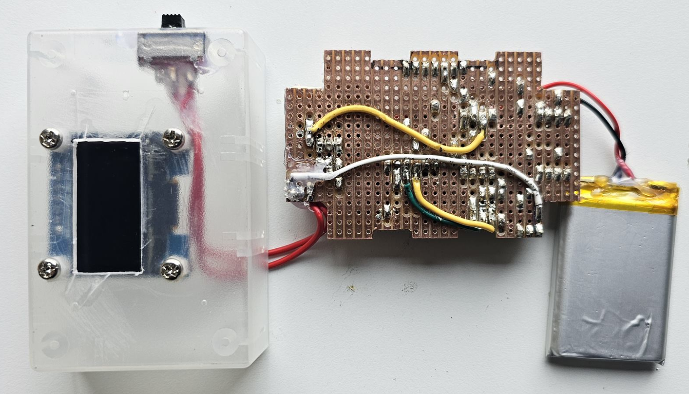
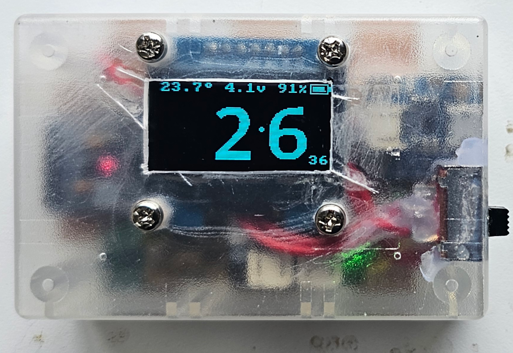
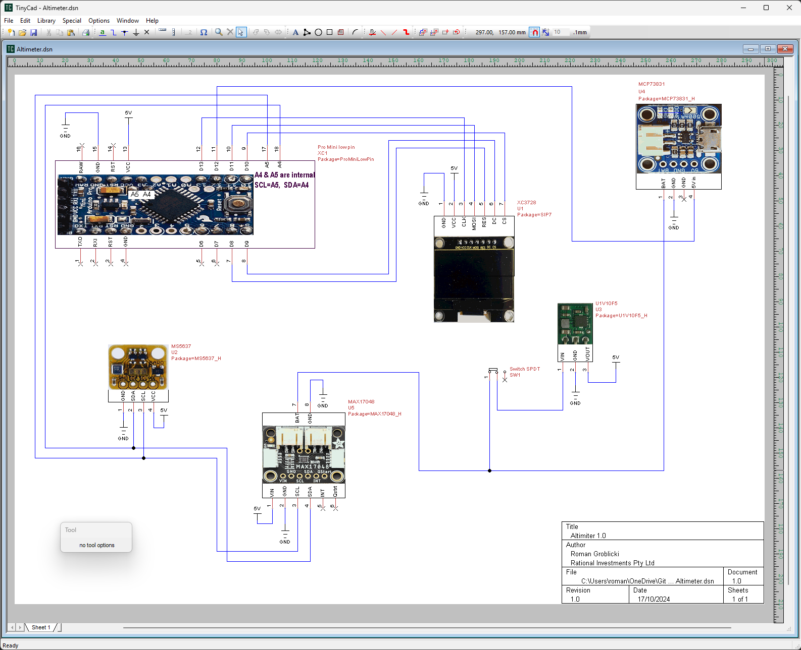
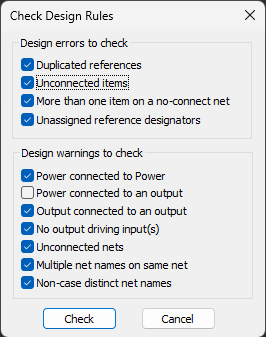
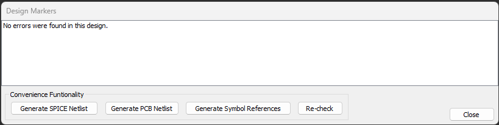
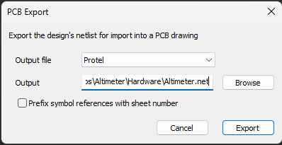
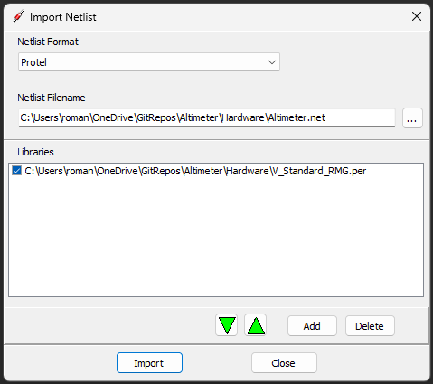
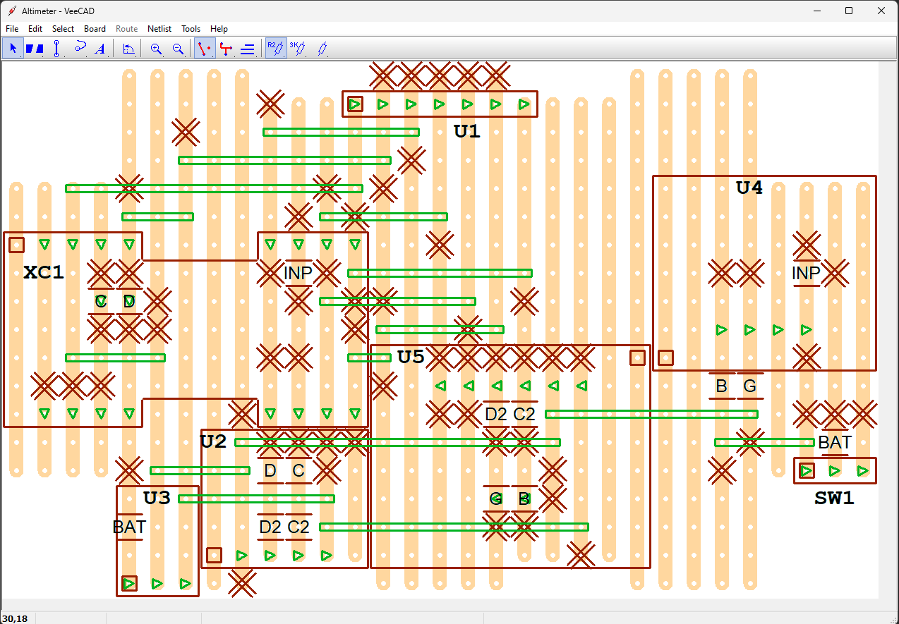
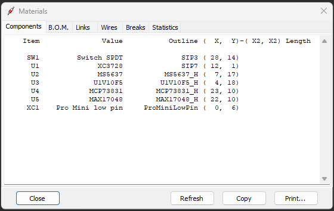
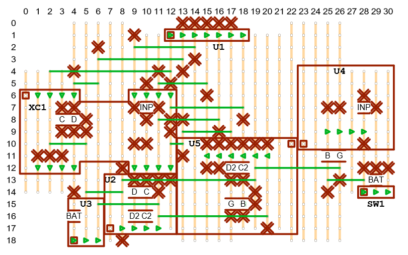

# Altimeter

## Contents

- [Summary](#summary)
- [Circuit design](#circuit-design)
  - [TinyCAD](#tinycad)
  - [VeeCAD](#veecad)
- [Assembly](#assembly)
- [Software](#software)
  - [Toolchain](#toolchain)
  - [Code](#code)
  - [LCD Assistant](#lcd-assistant)
  - [Programming](#programming)
 - [Parts list](#parts-list)
   - [Core components](#core-components)
   - [Connectors](#connectors)
   - [Other parts](#other-parts)
   - [External components](#external-components)

## Summary
This github repository details the construction of a proof of concept digital skydiving altimeter.

It is based on a pressure sensor board using the MS5637 chip and a 1.3" OLED SH1106 SPI driven screen. All is coordinated using an Arduino Pro Mini 5V 16Mhz microcontroller.  In addition it uses a circuit board based on the MCP73831 chip for charging the 3.7V LiPo battery and a battery level gauge circuit board using the MAX17048 chip. Voltage for the circuit is boosted from the LiPo to 5V by a Pololu U1V10F5 regulator board. There are no additional discrete components in this circuit apart from an on/off SPDT switch. Capactitors for current spikes have been considered but not implemented. 

The only interface elements are an on/off switch and a USB micro-B charging port. When first switched on the zeroed altitude is displayed in thousands of feet. A large font is used for digits above 99 feet. Eg. 13.532 indicates 13,532 feet above initial switching on altitude, with 13.5 displayed in a large font and 32 in small. Also a leading zero is dsiplayed for altitiudes inclusively between 100 and 999 feet. Eg 852 feet is displayed as 0.852 with 0.8 in large font and  52 in small.

In addition on the top line in a small font is displayed the temperature in Celsius on the pressure sensor board, the current voltage of the LiPo battery, its % remaining capacity and a graphic of the same. This also indicates if the battery is being charged. See third picture below.

## Circuit design
The logic of the circuit is displayed using TinyCAD and built onto a strip board using VeeCAD. Below the process is explained. To just do the build skip to the [Assembly](#assembly) section.

### TinyCAD

[**DOWNLOAD**](https://www.tinycad.net/Home/Download) and install TinyCAD if you don't already have it.

We need several files that can reside in any directories (on the PC where TinyCAD is installed) when copied from here or recreated.

**[Altimeter.dsn](Hardware/Altimeter.dsn)** is the actual file of the Altimeter circuit and is shown below when opened in the TinyCAD application.

**[Altimeter.net](Hardware/Altimeter.net)** is used by VeeCAD when designing the population of the veroboard. It is the PCB netlist file created in Protel format from the above file using the TinyCAD application.

With the above *.dsn file loaded into TinyCAD we use:

**Special=>Check Design Rules...=>Check=>Generate PCB NetList=>Export**

**[V_RomansOwn2020.TCLib](Hardware/V_RomansOwn2020.TCLib)** is the TinyCAD library file with custom symbols needed if we are recreating the above Altimeter.net file. 

### VeeCAD

[**DOWNLOAD**](https://veecad.com/downloads.html) and install VeeCAD if you don't already have it.

In addition we need the following files. They can reside in any directories (on the PC where VeeCAD is installed) when copied from here.

**[V_Standard_RMG.per](Hardware/V_Standard_RMG.per)** is the custom VeeCAD shape library file. It contains the shapes that will correspond to components supplied by the Altimiter.net TinyCAD file. It is an expanded copy of the V_Standard.per file that comes with VeeCAD. It is needed when the Altimeter.per file is created from the Altimeter.net file

**[Altimeter.per](Hardware/Altimeter.per)** is the actual diagram used to wire up the altimeter circuit (viewed through the VeeCAD application). This is ultimately all you need to build the altimeter together with the Altimeter.dsn file (displayed above) for reference.

When creating Altimeter.per you load the Altimeter.net file (Created by TinyCAD) using the V_Standard_RMG.per shape library file.
**Netlist=>Import=>Import**

This shows the circuit layout with the copper tracks underneath and components on top (See the first picture in thge Summary above).

**Board=>Matertials=>Components|B.O.M|Links|Wires|Breaks|Statistics**

Enables other details of the circuit to be displayed. Below we see the mapping between the Item id and the actual component name. 

The printed version of Altimeter.per is also usefull:

## Assembly
Insert contents

## Software
The details/logic of the software and how to set it up for burning is detailed in the next three sections. If you just want to burn the hex file skip to the Programming section below. 

### Toolchain
Insert contents

### Code
Insert contents

### LCD Assistant
download from https://en.radzio.dxp.pl/bitmap_converter/
I have used this to generate files for this project. Fonts, splash screens, graphics. Bitmaps generated with GIMP.
It only runs on Windows. No fancy downloads necessary. Just run the LCDAssistant.exe file from anywhere.
Its exe file is availble in the Extra directory.

LCD Assistant is a free tool for converting monochromatic bitmaps to data arrays for easy use with programs for embedded systems with microcontrollers and graphics monochromatic LCD displays like a T6963C, KS0108, SED1335 etc. Program creates files for use with any C compiler : for AVR, ARM, PIC, 8051 and ohter microcontrollers. You can use directly with Arduino, mbed and any other design environment based on C compiler. If you use graphic LCDs and you want to display pictures, this program is for You! You can draw an image in you best graphic editor and save it in a *.bmp file.

To convert image from bitmap file (or other standard graphics file format) to data array select from File menu command 'Load image'. Next, select byte orientation (for example : vertical for KS0108, SED1520, SPLC0501C etc; horizontal for : T6963C, SED1335 etc). If in data array must be image size (width and height) select 'Include size' checkbox and specify endianness of size (for example: Little endian for AVR; Big endian for ST7). Size are placed in two 16-bit variables at the begin of data array. Next, specify pixels/byte parameter. If display can support miscellaneous font size (displays with T6963C controller) image can be converted to array of bytes with specified amount of pixels in each byte. At last select from "File" menu command "Save output". Data array will be saved in specified file. Next, just include this file into project and use array name as parameter for function that displays bitmap on LCD. If you have trouble with use generating file, or program will generate wrong files please let me know.

### Programming
Insert contents

## Parts list
  
### Core components

| Qty | Product | Description | AUD Cost | Comment | Designator____ |
| --- | --- | --- | --- | --- | --- |
|1 | [CE05971](https://core-electronics.com.au/raspberry-pi-3-model-a-plus.html) | Raspberry Pi 3 Model A+ | $44.51 | Used for internet connection/control and storing collected data | connected to J2 and J8. Also camera attached |
|1 | [A000052](https://core-electronics.com.au/arduino-leonardo-without-headers.html) | Arduino Leonardo (Without Headers) | $39.00 | Used to interface all sensors | connected to J3, J5, J6 and J9 |
|1 | [XC4514](https://jaycar.com.au/p/XC4514) | Arduino Compatible DC Voltage Regulator | $7.95 | Converts 12V battery power to 5.2V for all weather station needs. Use 4 pins from 40 Pin Header Terminal Strip to attach its corners to Vero board | U1 |
|1 | [XC4486](https://jaycar.com.au/p/XC4486) | Arduino Compatible Logic Level Converter Module | $4.95 | enables bidirecional serial comms between Raspberry Pi and Arduino boards | B1 |
|1 | [ADA4226](https://core-electronics.com.au/adafruit-ina260-high-or-low-side-voltage-current-power-sensor.html) | Adafruit INA260 High or Low Side Voltage, Current, Power Sensor | $22.51 | measures power and voltage used by total circuit. Attach to Vero board using supplied 8 Pin Header Terminal Strip | B2 |
|1 | [ADA2652](https://core-electronics.com.au/adafruit-bme280-i2c-or-spi-temperature-humidity-pressure-sensor.html) | Adafruit BME280 I2C or SPI Temperature Humidity Pressure Sensor | $45.02 | off board sensor used in shielded I2C mode | connected to J7 |
|1 | [SEN-15901](https://core-electronics.com.au/weather-meter-kit.html) | Weather Meter Kit | $144.80 | passive reed switch based wind speed, direction and rain sensors | connected to J10 and J11 |
|1 | [BOB-14021](https://core-electronics.com.au/sparkfun-rj11-breakout.html) | SparkFun RJ11 Breakout ( currently only need 1 ) | $2.95 | contains below RJ11 Connector. Attach to Vero board using a 6 Pin Header Terminal Strip | J10 |
|2 | [PRT-00132](https://core-electronics.com.au/rj11-6-pin-connector.html) | RJ11 6-Pin Connector ( currently only need 1 )| $3.78 | attaches to above breakout board | |
|1 | [SY4058](https://jaycar.com.au/p/SY4058) | 6V DIL SPDT Mini Relay | $7.95 | used to control charging of Wifi Modem | U2 |
|1 | [YM2758](https://jaycar.com.au/p/YM2758) | Arduino Compatible 9G Micro Servo Motor | $11.95 | used to "manually" reset Wifi Modem, connect with three 2M lengths of hookup wire | connected to J4 |
|1 | [CE04421](https://core-electronics.com.au/raspberry-pi-camera-board-v2-8-megapixels-38552.html) | Raspberry Pi Camera Board v2 - 8 Megapixels | $38.95 | just for interest | connected to cable below |
|1 | [ADA1731](https://core-electronics.com.au/flex-cable-for-raspberry-pi-camera-610mm-24.html) | Flex Cable for Raspberry Pi Camera - 610mm / 24" | $6.66 | longer than standard cable for flexibility | connected to Raspberry Pi and camera
|1 | [SN74HC00N](https://au.element14.com/texas-instruments/sn74hc00n/quad-2-input-nand-74hc00-dip14/dp/3120419?st=74hc00) | Logic IC, NAND Gate, Quad, 2 Inputs, 14 Pins, DIP, 74HC00 | $0.61 | part of hardware debounce circuit for wind speed and rain sensors | connected to U5 |
|1 | [SN74HC14N](https://au.element14.com/texas-instruments/sn74hc14n/ic-hex-inverter-schmitt-74hc14/dp/9591125?st=74hc14) | Logic IC, Inverter, Hex, 1 Inputs, 14 Pins, DIP, 74HC14 | $1.03 | part of hardware debounce circuit for wind speed and rain sensors | connected to U4 |
|2 | [PI6501](https://jaycar.com.au/p/PI6501) | 14 Pin Production (Low Cost) IC Socket| $0.80 | part of hardware debounce circuit for wind speed and rain sensors | U4, U5 |
|1 | [RR0596](https://jaycar.com.au/p/RR0596) | 10k Ohm 0.5 Watt Metal Film Resistors - Pack of 8 ( only need 3 )| $0.85 | part of hardware debounce and input circuit for Weather Meter Kit sensors | R3, R5, R6 |
|1 | [RR0572](https://jaycar.com.au/p/RR0572) | 1k Ohm 0.5 Watt Metal Film Resistors - Pack of 8 ( only need 3 ) | $0.85 | used in hardware debounce and relay circuits | R1, R2, R4 |
|1 | [ZT2152](https://jaycar.com.au/p/ZT2152) | BC547 NPN Transistor | $0.30 | used in relay circuit | Q1 |
|1 | [ZR1004](https://jaycar.com.au/p/ZR1004) | 1N4004 1A 400V Diode - Pack of 4 ( only need 1 )| $0.98 | used in relay circuit | D1 |
|2 | [MCCB](https://au.element14.com/multicomp/mccb1v104m2acb/cap-0-1-f-35v-20/dp/9708480) | Tantalum Capacitor, 0.1 µF, 35 V, MCCB Series, ± 20%, Radial Leaded, 5.08 mm | $4.34 | used in hardware debounce circuit for wind speed and rain sensors | C1, C2 |

### Connectors

| Qty | Product | Description | AUD Cost | Comment | Designator____ |
| --- | --- | --- | --- | --- | --- |
|1 | [HP9544](https://jaycar.com.au/p/HP9544) | PC Boards Vero Type Strip - 95mm x 305mm| $12.95 | Contains all circuits apart from Raspberry Pi and Arduino |
|1 | [WW4030](https://jaycar.com.au/p/WW4030) | Tinned Copper Wire - 100 gram Roll | $19.95 | for wiring up above Vero board |
|5 | [HM3414](https://jaycar.com.au/p/HM3414) | 4 Pin 0.1 Straight Locking Header - 2.54 pitch - Single | $2.00 | On Vero board to connect to Raspberry Pi, Arduino and BMP280 sensor | J2, J3, J7, J9 |
|6 | [HM3412](https://jaycar.com.au/p/HM3412) | 2 Pin 0.1 Straight Locking Header - 2.54 pitch - Single | $2.40 | On Vero board and Arduino for interconnection | J5, J6, J8 |
|1 | [HM3413](https://jaycar.com.au/p/HM3413) | 3 Pin 0.1 Straight Locking Header - 2.54 pitch - Single | $0.40 | On Arduino for connection to Vero board circuit |
|3 | [HM3172](https://jaycar.com.au/p/HM3172) | 2 Way PCB Mount Screw Terminals 5mm Pitch | $4.05 | On Vero board for external connections to 12V power, Raspberry Pi and wind direction sensor | J1, J11, J12 |
|1 | [HM3173](https://jaycar.com.au/p/HM3173) | 3 Way PCB Mount Screw Terminal - 5mm Pitch | $1.75 | On Vero board for external connection to Wifi Modem switching servo | J4 |
|1 | [PS0916](https://jaycar.com.au/p/PS0916) | USB TYPE A PC MOUNT Socket | $2.95 | on Vero board for power to Wifi Modem | U3 |
|1 | [HP0924](https://jaycar.com.au/p/HP0924) | M3 x 12mm Tapped Nylon Spacers - Pk.25 ( only need 14 )| $9.95 | For mounting Vero board, Raspberry Pi, Arduino and camera|
|1 | [HP0430](https://jaycar.com.au/p/HP0430) | 3mm Flat Steel Washers - Pk.25 ( only need 12 )| $3.00 | as above |
|1 | [HP0440](https://jaycar.com.au/p/HP0440) | M3 x 5mm Black Equipment Screws - Pk.25 ( only need 14 )| $2.30 | as above |
|1 | [HP0403](https://jaycar.com.au/p/HP0403) | M3 x 10mm Steel Screws - Pk.25 ( only need 12 )| $3.00 | For mounting Vero board, Raspberry Pi and Arduino |
|1 | [HM3212](https://jaycar.com.au/p/HM3212) | 40 Pin Header Terminal Strip ( only need 4 pins ) | $1.10 | for mounting power circuit XC4514 |
|1 | [WC6026](https://jaycar.com.au/p/WC6026) | 150mm Socket to Socket Jumper Leads - 40 Piece ( only need 20 ) | $5.95 | for connecting Vero board circuits to Raspberry Pi and Arduino |
|1 | [WC6024](https://jaycar.com.au/p/WC6024) | 150mm Plug to Plug Jumper Leads - 40 Piece ( only need 3 ) | $5.95 | for connecting Vero board circuits to Servo and other external sensors |
|1 | [WC7723](https://jaycar.com.au/p/WC7723) | 0.5m USB A male to Micro-B Cable ( can be 0.25m ) | $5.95 | To power Arduino from Raspberry Pi USD port |
|1 | [WC7757](https://jaycar.com.au/p/WC7757) | USB A to USB Micro B Cable 150mm | $4.95 | To power Vero board circuit from Raspberry Pi (USB not needed) |

### Other parts

| Qty | Product | Description | AUD Cost | Comment | Designator____ |
| --- | --- | --- | --- | --- | --- |
|1 | [HP9544](https://jaycar.com.au/p/HP9544) | PC Boards Vero Type Strip - 95mm x 305mm| $12.95 | Contains all circuits apart from Raspberry Pi and Arduino |
|1 | [WW4030](https://jaycar.com.au/p/WW4030) | Tinned Copper Wire - 100 gram Roll | $19.95 | for wiring up above Vero board |
|5 | [HM3414](https://jaycar.com.au/p/HM3414) | 4 Pin 0.1 Straight Locking Header - 2.54 pitch - Single | $2.00 | On Vero board to connect to Raspberry Pi, Arduino and BMP280 sensor | J2, J3, J7, J9 |
|6 | [HM3412](https://jaycar.com.au/p/HM3412) | 2 Pin 0.1 Straight Locking Header - 2.54 pitch - Single | $2.40 | On Vero board and Arduino for interconnection | J5, J6, J8 |
|1 | [HM3413](https://jaycar.com.au/p/HM3413) | 3 Pin 0.1 Straight Locking Header - 2.54 pitch - Single | $0.40 | On Arduino for connection to Vero board circuit |
|3 | [HM3172](https://jaycar.com.au/p/HM3172) | 2 Way PCB Mount Screw Terminals 5mm Pitch | $4.05 | On Vero board for external connections to 12V power, Raspberry Pi and wind direction sensor | J1, J11, J12 |
|1 | [HM3173](https://jaycar.com.au/p/HM3173) | 3 Way PCB Mount Screw Terminal - 5mm Pitch | $1.75 | On Vero board for external connection to Wifi Modem switching servo | J4 |
|1 | [PS0916](https://jaycar.com.au/p/PS0916) | USB TYPE A PC MOUNT Socket | $2.95 | on Vero board for power to Wifi Modem | U3 |
|1 | [HP0924](https://jaycar.com.au/p/HP0924) | M3 x 12mm Tapped Nylon Spacers - Pk.25 ( only need 14 )| $9.95 | For mounting Vero board, Raspberry Pi, Arduino and camera|
|1 | [HP0430](https://jaycar.com.au/p/HP0430) | 3mm Flat Steel Washers - Pk.25 ( only need 12 )| $3.00 | as above |
|1 | [HP0440](https://jaycar.com.au/p/HP0440) | M3 x 5mm Black Equipment Screws - Pk.25 ( only need 14 )| $2.30 | as above |
|1 | [HP0403](https://jaycar.com.au/p/HP0403) | M3 x 10mm Steel Screws - Pk.25 ( only need 12 )| $3.00 | For mounting Vero board, Raspberry Pi and Arduino |
|1 | [HM3212](https://jaycar.com.au/p/HM3212) | 40 Pin Header Terminal Strip ( only need 4 pins ) | $1.10 | for mounting power circuit XC4514 |
|1 | [WC6026](https://jaycar.com.au/p/WC6026) | 150mm Socket to Socket Jumper Leads - 40 Piece ( only need 20 ) | $5.95 | for connecting Vero board circuits to Raspberry Pi and Arduino |
|1 | [WC6024](https://jaycar.com.au/p/WC6024) | 150mm Plug to Plug Jumper Leads - 40 Piece ( only need 3 ) | $5.95 | for connecting Vero board circuits to Servo and other external sensors |
|1 | [WC7723](https://jaycar.com.au/p/WC7723) | 0.5m USB A male to Micro-B Cable ( can be 0.25m ) | $5.95 | To power Arduino from Raspberry Pi USD port |
|1 | [WC7757](https://jaycar.com.au/p/WC7757) | USB A to USB Micro B Cable 150mm | $4.95 | To power Vero board circuit from Raspberry Pi (USB not needed) |

### External components

| Qty | Product | Description | AUD Cost | Comment |
| --- | --- | --- | --- | --- |
|1 | [PP1970](https://jaycar.com.au/p/PP1970) | Marine Grade 10A Locking Lighter Plug | $7.95 | Used to get 12V power from Battery Box |
|1 | [WH3057](https://jaycar.com.au/p/WH3057) | 7.5 Amp 2 Core Tinned DC Power Cable -  3 metre | $4.80 | Connects above to main vero circuit board |
|1 | [SB1682](https://jaycar.com.au/p/SB1682) | 12V 100Ah AGM Deep Cycle Battery | $299.0 | stores all power for this weather station  
|1 | [ZM9135](https://jaycar.com.au/p/ZM9135) | 12V 150W Folding Solar Panel with 5M lead (discontinued) | $169.00 | used to charge above battery - has controller |
|1 | [HB8502](https://jaycar.com.au/p/HB8502) | Battery Box with Voltmeter and USB Charge | $99.95 | keeps battery safe and conveniently accessible |
|1 | [WH3000](https://jaycar.com.au/p/WH3000) | Red Light Duty Hook-up Wire - 25m ( only 3 metres needed ) | $5.95 | used for attaching external sensors/servo |
|1 | [WH3001](https://jaycar.com.au/p/WH3001) | Black Light Duty Hook-up Wire - 25m ( only 3 metres needed ) | $5.95 | used for attaching external sensors/servo |
|1 | [WH3004](https://jaycar.com.au/p/WH3004) | Yellow Light Duty Hook-up Wire - 25m ( only 2 metres needed ) | $5.95 | used for attaching external sensors/servo |
|1 | [WB1506](https://jaycar.com.au/p/WB1506) |  FIG 8 - OFC Shielded Audio Cable - Sold per metre - 1 metre )| $4.95 | used for attaching external I2C sensor |
|1 | [HP1225](https://jaycar.com.au/p/HP1225) | 10mm Loom Tube - 10 metres ( only 4 metres needed ) | $18.95 | keeps wires to external sensors and wifi dongle secure |
|1 | [WifiModem](https://www.telstra.com.au/internet/mobile-broadband/telstra-4gx-hotspot) | Telstra 4GX Wi-Fi Pro | $120.0 | connects weather station to the internet |
|1 | [COU2AMB02](https://www.officeworks.com.au/shop/officeworks/p/comsol-male-type-a-usb-2-0-to-male-mini-usb-cable-2m-cou2amb02) | USB A to Mini-B 2M Cable | $14.88 | power to above wifi dongle from Vero board power circuit |
