# Altimeter

## Contents

- [Summary](#summary)
- [Circuit design](#circuit-design)
  - [TinyCAD](#tinycad)
  - [VeeCAD](#veecad)
- [Assembly](#assembly)
- [Software](#software)
  - [Toolchain](#toolchain)
  - [Code](#code)
  - [LCD Assistant](#lcd-assistant)
  - [HEX file](#hex-file)
- [Parts list](#parts-list)
  - [Core components](#core-components)
  - [Other parts](#other-parts)
  

## Summary
This github repository details the construction of a proof of concept digital skydiving altimeter.

It is based on a pressure sensor board using the MS5637 chip and a 1.3" OLED SH1106 SPI driven screen. All is coordinated using an Arduino Pro Mini 5V 16Mhz microcontroller.  In addition it uses a circuit board based on the MCP73831 chip for charging the 3.7V LiPo battery and a battery level gauge circuit board using the MAX17048 chip. Voltage for the circuit is boosted from the LiPo to 5V by a Pololu U1V10F5 regulator board. There are no additional discrete components in this circuit apart from an on/off DPDT switch. Capactitors for current spikes have been considered but not implemented. 

The only interface elements are an on/off switch and a USB micro-B charging port. When first switched on the zeroed altitude is displayed in thousands of feet. A large font is used for digits above 99 feet. Eg. 13.532 indicates 13,532 feet above initial switching on altitude, with 13.5 displayed in a large font and 32 in small. Also a leading zero is dsiplayed for altitiudes inclusively between 100 and 999 feet. Eg 852 feet is displayed as 0.852 with 0.8 in large font and  52 in small.

In addition on the top line in a small font is displayed the temperature in Celsius on the pressure sensor board, the current voltage of the LiPo battery, its % remaining capacity and a graphic of the same. This also indicates if the battery is being charged. See third picture below.

It is too large to be practical. The Screen needs to have better visibility in sunlight. The on/off switch needs to be flush/membrane and have a Cypress method to avoid accidental switching off. Probably use a small ESP32C3 board with battery management next time. Smaller battery and 3D printed case. 

If you just want to build the altimeter the go to [Assembly](#assembly) and then [HEX file](#hex-file).


## Circuit design
The logic of the circuit is displayed using TinyCAD and built onto a strip board using VeeCAD. Below the process is explained. To just do the build skip to the [Assembly](#assembly) section.

### TinyCAD

[**DOWNLOAD**](https://www.tinycad.net/Home/Download) and install TinyCAD if you don't already have it.

We need several files that can reside in any directories (on the PC where TinyCAD is installed) when copied from here or recreated.

**[Altimeter.dsn](Hardware/Altimeter.dsn)** is the actual file of the Altimeter circuit and is shown below when opened in the TinyCAD application.


**[Altimeter.net](Hardware/Altimeter.net)** is used by VeeCAD when designing the population of the veroboard. It is the PCB netlist file created in Protel format from the above file using the TinyCAD application.

With the above *.dsn file loaded into TinyCAD we use:

**Special=>Check Design Rules...=>Check=>Generate PCB NetList=>Export**


**[V_RomansOwn2020.TCLib](Hardware/V_RomansOwn2020.TCLib)** is the TinyCAD library file with custom symbols needed if we are recreating the above Altimeter.net file. 

### VeeCAD

[**DOWNLOAD**](https://veecad.com/downloads.html) and install VeeCAD if you don't already have it.

In addition we need the following files. They can reside in any directories (on the PC where VeeCAD is installed) when copied from here.

**[V_Standard_RMG.per](Hardware/V_Standard_RMG.per)** is the custom VeeCAD shape library file. It contains the shapes that will correspond to components supplied by the Altimiter.net TinyCAD file. It is an expanded copy of the V_Standard.per file that comes with VeeCAD. It is needed when the Altimeter.per file is created from the Altimeter.net file

**[Altimeter.per](Hardware/Altimeter.per)** is the actual diagram used to wire up the altimeter circuit (viewed through the VeeCAD application). This is ultimately all you need to build the altimeter together with the Altimeter.dsn file (displayed above) for reference.

When creating Altimeter.per you load the Altimeter.net file (Created by TinyCAD) using the V_Standard_RMG.per shape library file.
**Netlist=>Import=>Import**


This shows the circuit layout with the copper tracks underneath and components on top (See the first picture in the Summary above).

**Board=>Materials=>Components|B.O.M|Links|Wires|Breaks|Statistics**

Enables other details of the circuit to be displayed. Below we see the mapping between the Item id and the actual component name. 


The printed version of Altimeter.per is also usefull:


## Assembly
Here we detail the actual construction of the altimeter. The printed version of the Altimeter.per file is all you really need to do this, together with the component mappings.

Steps:
1. Cut out the strip board to the shown shape. It should fit snuggly into the Jiffy box.
1. Make the breaks in the copper tracks as indicated by the X's. Note: Altimiter.per always shows the non copper side of the veroboard, so be carefull when doing this.
1. Solder the wire links (green horizontal) using 22awg tinned copper wire. Make sure this is on the side without the copper strips and are flush to the board since some might be below some of the component boards and we don't want any shorts!
1. Install wire links INP, BAT, D2 & C2 using plastic shielded solid cored hookup wire on the copper side of the veroboard. Make sure that the wire does not extend to the non-copper side to avoid possible shorting!
1. Solder a 7pin 8.5mm high stackable header in position U1 on the non-copper side of veroboard.
1. Wire up the switch SW1 using 2 pieces of about 4cm of flexible hookup wire on the non-copper side of the veroboard at positions (14,28) and (14,29). Solder and use a glue gun sparingly to prevent flexing. Also use a glue gun on the switch side after soldering.
1. Solder 4 x 4pin terminal strips to the Pro Mini board as shown by the upside-down green triangles ie. positions: (6,1)-(6,4), (6,9)-(6-12), (12,1)-(12,4) and (12,9)-(12,12). Also solder a 6pin terminal strip to the top of the Pro Mini (used for programming it), approximate position (6,0)-(12,0). Cut them down to about 4mm (so that it fits in the enclosure)
1. Solder plastic shielded solid cored hookup wire to the underside of the Pro Mini at positions C and D (for I2C) and route it out the space at the bottom (position (12,6-7)).
1. Finaly solder the Pro Mini (XC1) to the non-copper side of the veroboard as indicated.
1. Solder (if necessary) a 3pin terminal strip to the U3 board at positions (18,4)-(18,6).
1. Carefully sand down its right hand side (so there is room when it butts up against U2), but be carefull not to damage it.
1. Finally solder U3 (the U1V10F5 board) to the non-copper side of the veroboard as indicated.
1. Solder the C and D wires to their positions that will be under the U2 board. Make sure that they are not too long, or short the wire links they pass over.
1. Carefully sand both sides of board U2 (so there is room when it butts up against U3 and U5), but be carefull not to damage it.
1. Solder (if necessary) a 4pin terminal strip to the U2 board at positions (17,8)-(17,11) .
1. Finally solder the U2 board (MS5637) to the non-copper side of the veroboard as indicated.
1. Solder plastic shielded solid cored hookup wire to the underside of the U5 board positions G and B (for the LiPo Battery) and route it out to the right around position (14,23).
1. Solder (if necessary) a 6pin terminal strip to the U5 board at positions (11,15)-(11,20) .
1. Finally solder the U5 board (MAX17048) to the non-copper side of the veroboard as indicated.
1. Solder the B and G wires to their respective positions (11,25) and (11,26) near to U4. Make sure that they are not too long, or short the wire links they pass over.
1. Solder (if necessary) a 4pin terminal strip to the U4 board at positions (9,25)-(9,28).
1. Finally solder the U4 board (MCP73831) to the non-copper side of the veroboard as indicated.
1. Attach U4 more securely to the veroboard by adding some wood to the space between U4 and tghe veroboard and fix with a glue gun.
1. Attach the LiPo battery to U4. Check beforehand that the polarity is correct. We now have a veroboard circuit with externally attached battery and switch (see first picture in the Summasry section).
1. Solder (if necessary) a 7pin terminal strip to the U1 board (OLED screen XC3728).
1. Now insert this screen into the stacking header from point 5 above, so that it partially covers XC1, U2 and U5. 
1. Insert this whole combined circuit board with screen into the bottom of the 83x54x31mm Jiffy box, screen first. This should fit and enable you to find the positions for screwing the screen to the bottom of the box as well as the cutout for the screen. It should also show you the cuttout necessary for the XC1 programing pins at positions (6,0)-(12,0).
1. After removing the circuit from the the box carefully create the above openings and holes.
1. Using appropriate screws (not too long) and short plastic spacers attach the screen to the bottom of the box. See the first three pictures in the Summary section.
1. Insert the veroboard back into the veroboard. This will finalise the position of the cutout necessary to access the USB charging socket at the side of the box.
1. Remove the circuit from the box and thus the screen. Create the cutout for the USB charging socket and also on the same side for the switch.
1. Stick the switch to the inside of Jiffy box so that the slider can freely move through the cutout. Also use the glue gun. See the first three pictures in the Summary section of how this should look.
1. Reinstall the veroboard into the screen and then into the box. In doing so be carefull how you route the switch wiring.
1. Place some thin plastic from an antistatic bag on the copper side of the veroboard when it is in the Jiffy box and the place the LiPo battery on it being carefull with the wiring.
1. You can now screw the Jiffy box shut. As long as the screen spacers are not too long there should be enough yet snug room for the battery. Everything is now ready to program the Pro Mini.

Below are some pictures to assist with assembly:
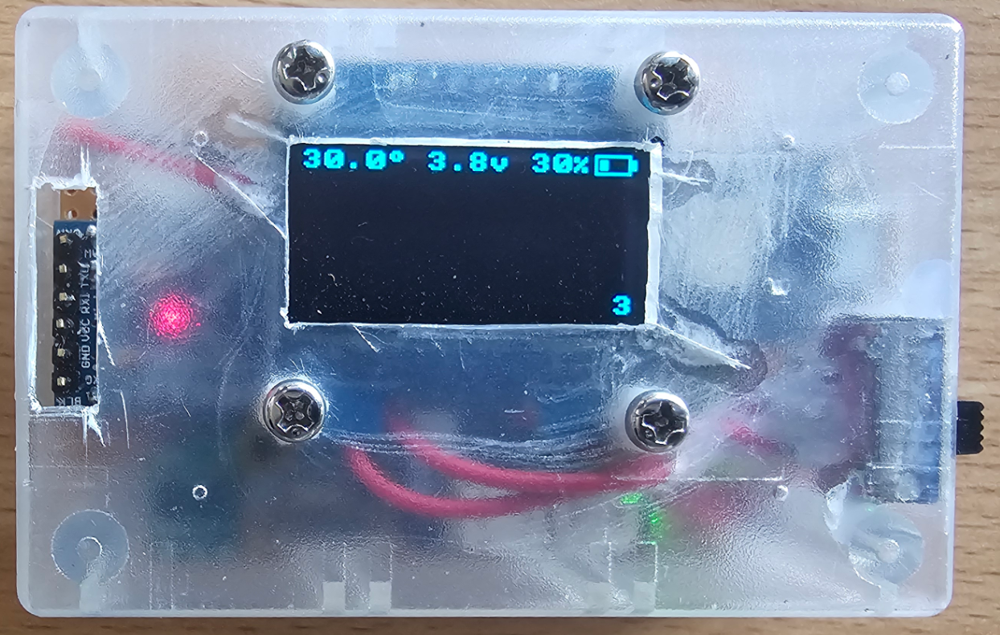
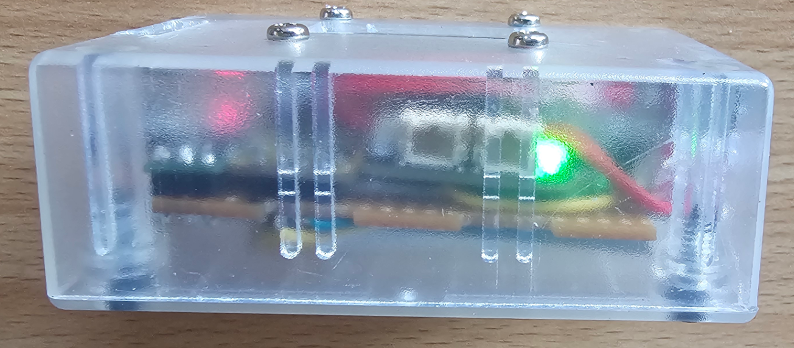
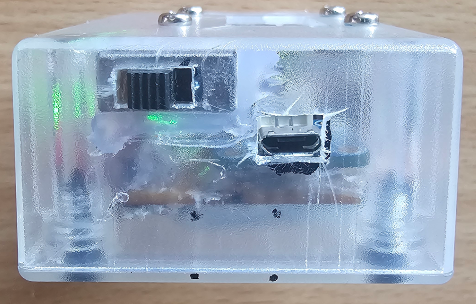
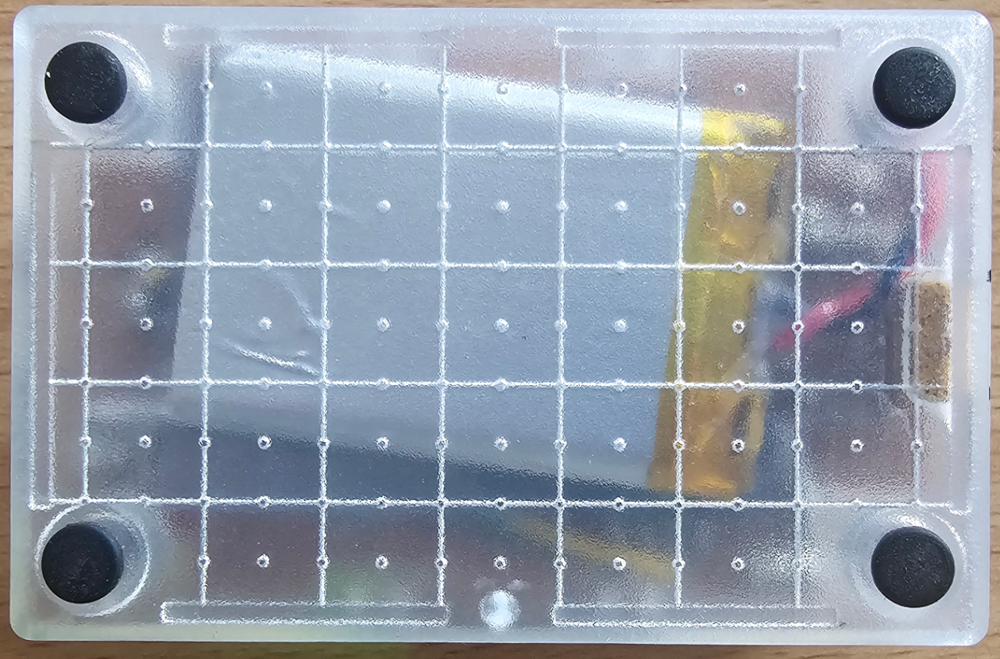

## Software
The details/logic of the software and how to set it up for burning is detailed in the next three sections. If you just want to burn the hex file skip to the [HEX file](#hex-file) section below. 

### Toolchain
Development is assumed to be done using the Arduino IDE on a Windows machine.
I used Version 2.3.3 with default installation. Since the altimeter uses the Adafruit MAX1704X Lipo Monitor / Fuel Gauge breakout (U5) we need to install the Adafruit MAX1704X library

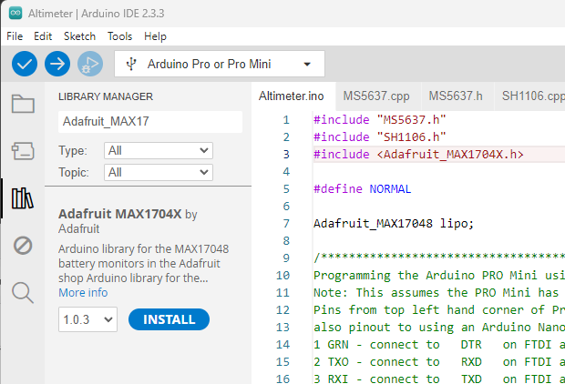

Install with dependancies

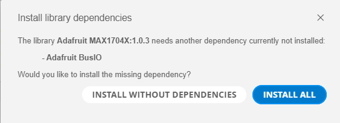

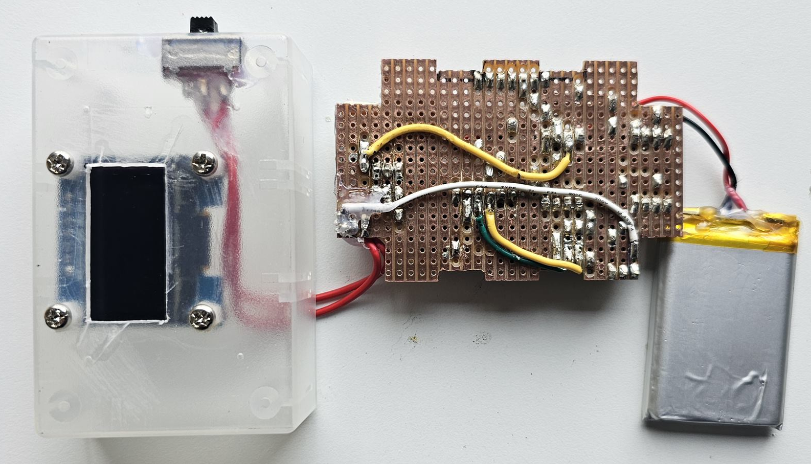

Now to compile the code for the Pro Mini (XC1) you just need to place the following files in an arbitrary directory. This will be discussed in detail in the next section. It can most conveniently be the one you clone this repository into: [Your Repository Directory]\Altimeter\Code\Altimeter.

The required files in this directory are:<br>
[Altimeter.ino](Code/Altimeter/Altimeter.ino)<br> 
[SH1106.h](Code/Altimeter/SH1106.h)<br>
[MS5637.h](Code/Altimeter/SH1106.h)<br>
[Display.h](Code/Altimeter/SH1106.h)<br>
[SH1106.cpp](Code/Altimeter/SH1106.cpp)<br>
[MS5637.cpp](Code/Altimeter/SH1106.cpp)<br>

Run the Arduino IDE and open the Altimeter.ino from the above directory. This will open all these files in seperate tabs (see picture below):

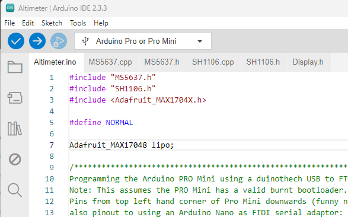<br>

Select the correct Board and Processor:<br>
**Tools=>Board:CURRENT=>Boards Manager...=>Arduino AVR Boards=>Arduino Pro or Pro Mini=>Enter**
**Tools=>Processor:CURRENT=>ATmega328P (5V, 16 MHz)=>Enter**

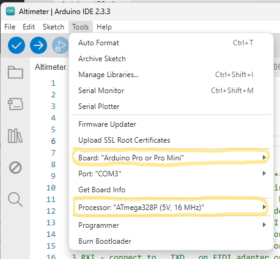

Now to actually program the Pro Mini (which is assumed to have a bootloader) you will need an FTDI Serial Adaptor. There are many options Eg. the Duinotch Arduino Compatible USB to Serial Adaptor [XC4464](https://jaycar.com.au/p/XC4464) sold by Jaycar:

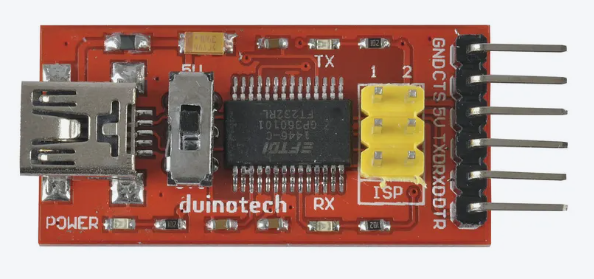

The resulting USB connection between the PC and altimeter is shown below. You will need to make up 6xmale from the breadboard to 6xfemale into the ProMini.

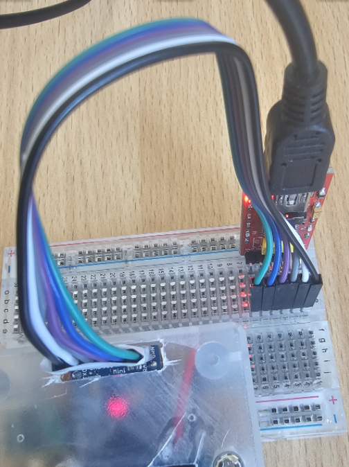

To now actually program the Pro Mini. With the previous setup make sure the correct live COM port is selected. Then 
**Sketch=>Upload=>Enter**

With verbose output set you will see something like this:
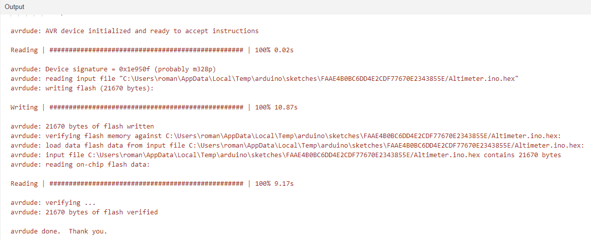


### Code
All the magic for the altimeter happens in the code written for the Arduino Pro Mini (XC1) using the Arduino IDE.
It interfaces with 3 peripheral boards. Using I2C it sets up the Pressure sensor (U2) and polls in the loop of the main source file Altimeter.ino generating the altitude data above initial ground level. The temperature on chip is also measured. The Battery level board (U5) is also polled using I2C, with data generated within the main loop. Using custom bit-bashed SPI interface protocol the polled data is then displayed on the OLED screen (U1), being updated in the main loop. The status of whether the LiPo battery is being charged is also polled in the main loop and displayed via a graphic on the screen.

Below is the main source code file [Altimeter.ino](Code/Altimeter/Altimeter.ino).<br>
It creates objects representing the Pressure sensor board, Battery level board and OLED screen. These are initialised in the setup() function and then polled in the loop() function. The charging status of the LiPo battery is also polled in the loop() function via pin D12 of the Pro Mini.<br>
Header files are included to access the libraries for each object created above. in particular ["MS5637.h"](Code/Altimeter/MS5637.h) for the pressure sensor (U2), ["SH1106.h"](Code/Altimeter/SH1106.h) for the OLED screen (U1) and <Adafruit_MAX1704X.h> for the battery level board (U5).
The first two have been customized/simplified from existing library code and as such have been explicitly included in the directory of the main source Altimeter.ino file ie. both the *.h and *.cpp files. As such they are shown and discussed below. The last header refers to an external vendors library that was installed via the Arduino IDE. The source code for this is not visible and is not further discussed though if you are interested the code is informed by the [MAX17048-MAX17049.pdf](Extra/MAX17048-MAX17049.pdf). 

```cpp
#include "MS5637.h"
#include "SH1106.h"
#include <Adafruit_MAX1704X.h>

#define NORMAL

Adafruit_MAX17048 lipo;

/*************************************************************************************************
Programming the Arduino PRO Mini using a duinothech USB to FTDI Serial Adatptor Module (XC-4464),
Note: This assumes the PRO Mini has a valid burnt bootloader.
Pins from top left hand corner of Pro Mini downwards (funny names on board),
also pinout to using an Arduino Nano as FTDI serial adaptor:
1 GRN - connect to   DTR   on FTDI adapter or   RST   on Nano programmer
2 TXO - connect to   RXD   on FTDI adapter or   TXI   on Nano programmer
3 RXI - connect to   TXD   on FTDI adapter or   RXO   on Nano programmer
4 VCC - connect to   5V    on FTDI adapter or   5V    on Nano programmer
5 GND - connect to   CTS   on FTDI adapter or   GND   on Nano programmer
6 BLK - connect to   GND   on FTDI adapter or   GND   on Nano programmer
*************************************************************************************************/

// An instance of the SH1106 class called OLED is created
// The module uses an enhanced 3-Wire SPI communications protcol
// The specified pins are: CLK, MOS, RES, DC, CS.
SH1106 OLED(13, 11, 8, 9, 10);

// An instance of the MS5637 called BARO is created
// The module is I2C and has just 4 pins:
// 1 GND - connect to ground pin on micro (Arduino Pro Mini 5V 16Mhz assumed here)
// 2 SDA - connect to SDA pin on micro (also called A4)
// 3 SCL - connect to SCL pin on micro (also called A5)
// 4 VCC - connect to VCC pin on micro (assumed 5V)
MS5637 BARO;

 // Pin connected to the 5V level of the lipo charging board (16)
const int chargePin = 12;

// global variables
float temp, pressure, altBase, altRel, cellPer, cellVol;
float test = 0.0;

void setup() {
  Serial.begin(9600);
  OLED.setBrightness(0xFF);

#ifdef NORMAL
  while(!lipo.begin()) {
    Serial.println(F("Couldn't find Adafruit MAX17048? Make sure a battery is plugged in!"));
    OLED.BatteryErrorGraphic(0, 112);
    delay(5000);
  }
  Serial.print(F("Found MAX17048 with Chip ID: 0x"));
  Serial.println(lipo.getChipID(), HEX);
#endif

  pinMode(chargePin, INPUT); // set the button pin as input (there are some floating problems?)

  // setup MS5637 sensor (An instance of the MS5637 object BARO has been constructed above)
  BARO.begin();
  BARO.dumpDebugOutput();
  BARO.getTempAndPressure(&temp, &pressure);
  altBase = BARO.pressure2altitude(pressure);
  altBase = 0.0;
  Serial.println(altBase);
}


void loop() {

#ifdef NORMAL 
 cellVol = lipo.cellVoltage();
  if (isnan(cellVol)) {
    Serial.println("Failed to read cell voltage, check battery is connected!");
    lipo.begin();
    OLED.BatteryErrorGraphic(0, 112);
    delay(2000);
    return;
  }
  
  cellPer = lipo.cellPercent();
  OLED.BatteryVoltage(cellVol, 0, 48);
  OLED.BatteryPercentage(cellPer, 0, 88);
  //int chargeState = digitalRead(chargePin);
  //bool charging = (chargeState==HIGH)
  OLED.BatteryLevelGraphic(cellPer, 0, 112, (digitalRead(chargePin)==HIGH));
#endif

  if (!BARO.isOK()) {
    // Try to reinitialise the sensor if we can and measure temperature and pressure
    BARO.begin();
    BARO.getTempAndPressure(&temp, &pressure);
  }
  else { // just normal measurements on each loop
    BARO.getTempAndPressure(&temp, &pressure);
  }

  // Calculate altitude relative to where the altimeter was turned on
  altRel = BARO.pressure2altitude(pressure) - altBase;

  // display current temperature measured by the MS5637 (and used to
  // improve calculation of air pressure)
  OLED.Temperature(temp, 0, 0);

  // display current altitudete (adjusted to ground) measured by the MS5637
  OLED.Altitude_largefont(altRel+test);

  // necessary for some strange reason!
  OLED.writeEND();

  Serial.print(temp);
  Serial.print(" ");
  Serial.println(altRel);

  delay(100);
}
```

Below is the header file [MS5637.h](Code/Altimeter/MS5637.h) for my Pressure Sensor (U2) "library".

```cpp
/* BaroSensor
 *
 * An Arduino library for the Freetronics BARO sensor module, using
 * the MS5637 Pressure/Temperature sensor module.
 * Stolen and modified from Angus Gratton (angus at freetronics dot com)
 */
#include <Arduino.h>
#include <Wire.h>

/* i2c address of module */
#define BARO_ADDR 0x76

enum OSR {OSR_256, OSR_512, OSR_1024, OSR_2048, OSR_4096, OSR_8192 };
enum TempUnit {CELSIUS, FAHRENHEIT};

/* delay to wait for sampling to complete, on each OSR level */
const uint8_t SamplingDelayMs[6] PROGMEM = {2,4,6,10,18,34};

/* the 5 basic commands of the MS5637 module */
#define CMD_RESET 0x1E
#define CMD_START_D1(osl) (0x40 + 2*osl) // 6 possibilities, for each OSR enum  
#define CMD_START_D2(osl) (0x50 + 2*osl) // 6 possibilities, for each OSR enum  
#define CMD_PROM_READ(offs) (0xA0+(offs<<1)) // offs ranges from 0 to 6 (7 adressess, totalling 112 bits)
#define CMD_READ_ADC 0x00

/* error codes */
#define ERR_NOREPLY -1
#define ERR_BAD_READLEN -2
#define ERR_NEEDS_BEGIN -3


class MS5637 {
 public:
  MS5637() : initialised(false), err(ERR_NEEDS_BEGIN) { }
  
  void begin();

  /* Update both temperature and pressure together. This takes less
     time than calling each function separately (as pressure result
     depends on temperature.) Returns true for success, false on an
     error, TempUnit & OSR have defaults of CELSIUS & OSR_8192 */
  bool getTempAndPressure(float *temperature,
                          float *pressure,
                          TempUnit tempScale = CELSIUS,
                          OSR level = OSR_8192);

  inline bool isOK() { return initialised && err == 0; }
  inline byte getError() { return initialised ? err : ERR_NEEDS_BEGIN; }

  /* Debugging function that outputs a list of debugging data to Serial */
  void dumpDebugOutput();

  // Returns altitude (in feet) for a given pressure (in mbar)
  float pressure2altitude(float pressure);
  
private:
  bool initialised;
  int8_t err;
  uint16_t c1,c2,c3,c4,c5,c6; // Calibration constants used in producing results

  uint32_t takeReading(uint8_t trigger_cmd, OSR oversample_level);
};
```

Below is the source file [MS5637.cpp](Code/Altimeter/MS5637.cpp) for my Pressure Sensor (U2) "library".<br>
It uses the the Wire library for I2C. Ultimately this code is informed by the [ENG_DS_MS5637-02BA03_B5.pdf](Extra/ENG_DS_MS5637-02BA03_B5.pdf) document about the pressure sensor chip.
  
```cpp
#include "MS5637.h"

void MS5637::begin() {
  Wire.begin();
  Wire.beginTransmission(BARO_ADDR);
  Wire.write(CMD_RESET);
  if((err = Wire.endTransmission(true))) return;
  
  uint16_t prom[7];
  for(int i = 0; i < 7; i++) {
    Wire.beginTransmission(BARO_ADDR);
    Wire.write(CMD_PROM_READ(i));
    if((err = Wire.endTransmission(false))) return;
    if(Wire.requestFrom(BARO_ADDR, 2, true) != 2) {err = ERR_BAD_READLEN; return;}
    prom[i] = (((uint16_t)Wire.read()) << 8) | (uint16_t)Wire.read();
  }

  // TODO verify CRC4 in top 4 bits of prom[0] (follows AN520 but not directly...)
  c1 = prom[1];
  c2 = prom[2];
  c3 = prom[3];
  c4 = prom[4];
  c5 = prom[5];
  c6 = prom[6];
  initialised = true;
}

bool MS5637::getTempAndPressure(float *temperature, float *pressure, TempUnit tempScale, OSR level) {
  if(err || !initialised) return false;
  int32_t d2 = takeReading(CMD_START_D2(level), level);
  if(d2 == 0) return false;
  int64_t dt = d2 - c5 * (1L<<8);
  int32_t temp = 2000 + (dt * c6) / (1L<<23);

  /* Second order temperature compensation */
  int64_t t2;
  if(temp >= 2000) {
    /* High temperature */
    t2 = 5 * (dt * dt) / (1LL<<38);
  } else {
    /* Low temperature */
    t2 = 3 * (dt * dt) / (1LL<<33);
  }

  if(temperature != NULL) {
    *temperature = (float)(temp - t2) / 100;
    if(tempScale == FAHRENHEIT)
    
      *temperature = *temperature * 9 / 5 + 32;
  }

  if(pressure != NULL) {
    int32_t d1 = takeReading(CMD_START_D1(level), level);
    if(d1 == 0) return false;
    int64_t off = c2 * (1LL<<17) + (c4 * dt) / (1LL<<6);
    int64_t sens = c1 * (1LL<<16) + (c3 * dt) / (1LL<<7);

    /* Second order temperature compensation for pressure */
    if(temp < 2000) {
      /* Low temperature */
      int32_t tx = temp-2000;
      tx *= tx;
      int32_t off2 = 61 * tx / (1<<4);
      int32_t sens2 = 29 * tx / (1<<4);
      if(temp < -1500) {
        /* Very low temperature */
        tx = temp+1500;
        tx *= tx;
        off2 += 17 * tx;
        sens2 += 9 * tx;
      }
      off -= off2;
      sens -= sens2;
    }

    int32_t p = ((int64_t)d1 * sens/(1LL<<21) - off) / (1LL << 15);
    *pressure = (float)p / 100;
  }
  return true;
}

uint32_t MS5637::takeReading(uint8_t trigger_cmd, OSR oversample_level)
{
  Wire.beginTransmission(BARO_ADDR);
  Wire.write(trigger_cmd);
//  Wire.endTransmission(true);
  if((err = Wire.endTransmission(true))) return 0;
  uint8_t sampling_delay = pgm_read_byte(SamplingDelayMs + (int)oversample_level);
  delay(sampling_delay);

  Wire.beginTransmission(BARO_ADDR);
  Wire.write(CMD_READ_ADC);
//  Wire.endTransmission(true);
  if((err = Wire.endTransmission(false))) return 0;
    
  int req = Wire.requestFrom(BARO_ADDR, 3);
  if(req != 3) req = Wire.requestFrom(BARO_ADDR, 3); // Sometimes first read fails...?
  if(req != 3) {err = ERR_BAD_READLEN; return 0;}

//  Wire.requestFrom(BARO_ADDR, 3, true);
  uint32_t result = ((uint32_t)Wire.read() << 16) | ((uint32_t)Wire.read() << 8) | Wire.read();
  return result;
}

void MS5637::dumpDebugOutput()
{
  Serial.print(F("C1 = 0x"));
  Serial.println(c1, HEX);
  Serial.print(F("C2 = 0x"));
  Serial.println(c2, HEX);
  Serial.print(F("C3 = 0x"));
  Serial.println(c3, HEX);
  Serial.print(F("C4 = 0x"));
  Serial.println(c4, HEX);
  Serial.print(F("C5 = 0x"));
  Serial.println(c5, HEX);
  Serial.print(F("C6 = 0x"));
  Serial.println(c6, HEX);
  Serial.print(F("d1 first = 0x"));
  Serial.println(takeReading(CMD_START_D1(OSR_8192), OSR_8192));
  Serial.print(F("d2 first = 0x"));
  Serial.println(takeReading(CMD_START_D2(OSR_8192), OSR_8192));
  Serial.print(F("d1 second = 0x"));
  Serial.println(takeReading(CMD_START_D1(OSR_8192), OSR_8192));
  Serial.print(F("d2 second = 0x"));
  Serial.println(takeReading(CMD_START_D2(OSR_8192), OSR_8192));
  Serial.print(F("d1 third = 0x"));
  Serial.println(takeReading(CMD_START_D1(OSR_8192), OSR_8192));
  Serial.print(F("d2 third = 0x"));
  Serial.println(takeReading(CMD_START_D2(OSR_8192), OSR_8192));
  float temp, pressure;
  bool res = getTempAndPressure(&temp, &pressure);
  Serial.print(F("result (fourth) = "));
  Serial.println(res ? F("OK") : F("ERR"));
  Serial.print(F("Temp (fourth) = "));
  Serial.println(temp);
  Serial.print(F("Pressure (fourth) = "));
  Serial.println(pressure);
  Serial.print(F("Error (fourth) = "));
  Serial.println(err);
}

float MS5637::pressure2altitude(float pressure)
{
  float altitude = 145366.45*(1-pow(pressure/1013.25,0.190284));
  return altitude;
}
```

Below is the header file [SH1106.h](Code/Altimeter/SH1106.h) for my OLED screen (U1) "library".

```cpp
#include <Arduino.h>

#define SH1106_SET_COLUMN_ADDR_LOW 0x00
#define SH1106_SET_COLUMN_ADDR_HIGH 0x10
#define SH1106_SET_CONTRAST 0x81
#define SH1106_SET_SEGMENT_REMAP 0xA0
#define SH1106_SET_INVERT_DISPLAY 0xA6
#define SH1106_SET_DISPLAY_ON 0xAE
#define SH1106_SET_PAGE_ADDR 0xB0
#define SH1106_SET_COM_SCAN_DIR 0xC0

/*  
 The module (in 4-wire SPI mode) has 7 pins (which on the Arduino PRO Mini with HW SPI use):
 1 GND - connect to ground pin on micro (Arduino Pro Mini 5V 16Mhz assumed here)
 2 VCC - connect to VCC pin on micro (assumed 5V)
 3 CLK - Clock, connect to Pin 13 on micro (assumed by default) - WIRE 1 
       - Called SCL Wire 3 in SH1106 pdf
  MISO - Master In Slave Out, NOT AVAILABLE HERE - but would be pin 12 on micro - WIRE 3 
 4 MOSI - Master Out Slave In, connect to pin 11 on micro (assumed by default) - WIRE 2
        - also called SDI or SI Wire 2 in SH1106 pdf
 5 RES - Reset, connect to Pin 8 (can change) 
       - Called RES (Upper score) in SH1106 pdf
 6 DC - Data/Command, connect to pin 9 (can change)
      - Called A0 (HIGH= data mode, LOW= command mode) Wire 4 in SH1106 pdf 
 7 CS - Chip Select, connect to pin 10 (can change) - WIRE 4 
      - Called CS (upper score) Wire 1 in SH1106 pdf
Note: The screen pixels are accessed in vertical bytes (least significant bit at top),
8 pages (giving 64 = 8 x 8 bits), there are 128 visible columns, strangely ranging
from 2 to 129.      
*/

class SH1106 {
  public:

  // constructor - includes init()
  SH1106(uint8_t clk, uint8_t mos, uint8_t res, uint8_t dc, uint8_t cs); 

  private:
  
  uint8_t clkPin, mosPin, resPin, dcPin, csPin;

  // specific char arrays used when displaying text on OLED
  char sbo[17]; char sb[17];
  char str_old4[17]; char str_new4[17]; 
  char str_old3[17]; char str_new3[17];
  char str_old2[17]; char str_new2[17];
  char str_old1[17]; char str_new1[17];
  char str_old0[17]; char str_new0[17];
  char str_old[17]; char str_new[17];

  // low level SPI comms with SH1106
  void TransferStart();
  void CommandMode();
  void DataMode();
  void Write(uint8_t d);
  void TransferEnd();

  // setup functions 
  void init(); // just a wrapper for the following functions
  void initPins();
  void reset();
  void clearDisplayRam();
  void configureDefault();

  // specific internal utility functions
  uint16_t ASCII2offset(char char_, uint16_t offsetScale);


  public:

  // utility functions
  void setBrightness(uint8_t brightness);

  // core displaying functions
  void invert();
  void uninvert();
  void writeBlock(uint8_t page, uint8_t col, uint8_t pages, uint8_t cols, uint16_t address, const uint8_t Arr[]);
  void write8x8Char(uint8_t page, uint8_t column, uint16_t charCode, const uint8_t Arr[][8]);

  // specific displaying functions
  void BatteryVoltage(float cellVol_, uint8_t page, uint8_t col);
  void BatteryPercentage(float cellPer_, uint8_t page, uint8_t col);
  void BatteryLevelGraphic(float cellPer_, uint8_t page, uint8_t col, bool chargeing);
  void BatteryErrorGraphic(uint8_t page, uint8_t col);
  void Temperature(float temp_, uint8_t page, uint8_t col);
  void Altitude_smallfont(float altitude, uint8_t page, uint8_t col);
  void Altitude_largefont(float altitude);

  void writeEND();
};
```

Below is the source file [SH1106.cpp](Code/Altimeter/SH1106.cpp) for my OLED screen (U1) "library".<br>
It uses a custom bit-bashed SPI interface explicitly coded here. Ultimately this code is informed by the [SH1106.pdf](Extra/SH1106.pdf) document that about driver and controller chip used by the display voard. It also includes the Display.h file which contains all the font and graphic data needed by the display.

```cpp
#include "Arduino.h"
#include "SH1106.h"
#include "Display.h"

// Constructor
SH1106::SH1106(uint8_t clk, uint8_t mos, uint8_t res, uint8_t dc, uint8_t cs) {
  // set pin numbers
  clkPin = clk; mosPin = mos; resPin = res; dcPin = dc; csPin = cs;
  init();

  // initialise str_old*, for its first use in loop(),
  // size is enough to store 16 characters, but often less is used.
  for (int i=0; i<16; i++) {
    sbo[i] = ' ';
    str_old4[i] = ' ';
    str_old3[i] = ' ';
    str_old2[i] = ' ';
    str_old1[i] = ' ';
    str_old0[i] = ' ';
    str_old[i] = ' ';
  }  
} 

void SH1106::TransferStart() {
  digitalWrite(csPin, LOW);  // CS (Upper score) 
}

void SH1106::CommandMode() {
  digitalWrite(dcPin, LOW); // A0 set to LOW
}

void SH1106::DataMode() {
  digitalWrite(dcPin, HIGH); // A0 set to HIGH
}

// bit-bashed SPI write a byte code using cls and mos pins
void SH1106::Write(uint8_t d) {
  for (int i=7; i>=0; --i) {
    digitalWrite(clkPin, LOW);
    digitalWrite(mosPin, d >> i & 1);
    digitalWrite(clkPin, HIGH);
  }
}

void SH1106::TransferEnd() {
  digitalWrite(csPin, HIGH);
}

void SH1106::init() {
    initPins();
    reset();
    clearDisplayRam();
    configureDefault();
}

void SH1106::initPins() {
  pinMode(resPin, OUTPUT); 
  digitalWrite(resPin, HIGH);
  pinMode(clkPin, OUTPUT);
  pinMode(mosPin, OUTPUT);
  pinMode(dcPin, OUTPUT);
  pinMode(csPin, OUTPUT);
}

void SH1106::reset() {
  // hold res pin LOW for a while 
  digitalWrite(resPin, LOW); 
  delayMicroseconds(10);
  digitalWrite(resPin, HIGH);
}

void SH1106::clearDisplayRam() {
  TransferStart();
  CommandMode();
  Write(SH1106_SET_COLUMN_ADDR_LOW | 2);
  for (uint8_t page = 0; page < 8; page++) {
    CommandMode();
    Write(SH1106_SET_PAGE_ADDR | page);
    Write(SH1106_SET_COLUMN_ADDR_HIGH | 0);
    DataMode();
    for (uint8_t i = 0; i < 128; i++) Write(0);
  }
  TransferEnd();
}

void SH1106::configureDefault() {
  TransferStart();
  CommandMode();
  Write(SH1106_SET_SEGMENT_REMAP | 1);  // flip horizontally
  Write(SH1106_SET_COM_SCAN_DIR | 8);   // flip vertically
  Write(SH1106_SET_CONTRAST);
  Write(0x10);                          // set lower brightness
  Write(SH1106_SET_DISPLAY_ON | 1);

  // rotate 180 - omit if necessary
  //Write(SH1106_SET_SEGMENT_REMAP);      
  //Write(SH1106_SET_COM_SCAN_DIR);       
  TransferEnd();
}

void SH1106::invert() {
  TransferStart();
  CommandMode();
  Write(SH1106_SET_INVERT_DISPLAY | 1);
  TransferEnd();
}

void SH1106::uninvert() {
  TransferStart();
  CommandMode();
  Write(SH1106_SET_INVERT_DISPLAY | 0);
  TransferEnd();
}

// between 0x00 and 0xFF, Note: 0x00 is not blank
void SH1106::setBrightness(uint8_t brightness) {
  TransferStart();
  CommandMode();
  Write(SH1106_SET_CONTRAST);
  Write(brightness); // set brightness
  TransferEnd();
}

// displays a block of data to screen, at top-left-hand position (page, col),
// ie pixel row is pagex8 and pixel column is col.
// the height is pages high (ie pagesx8 pixels) and cols pixels wide.
// the data (in vertical-encoding) is stored in a 1d array of bytes called Arr,
// while the offset for individual bytes (to display) is address which has to be uint16_t
// since the array might have more than 256 elements.
void SH1106::writeBlock(uint8_t page, uint8_t col, uint8_t pages, uint8_t cols, uint16_t address, const uint8_t Arr[]) {
  uint8_t columnByte;
  TransferStart();
  for (uint8_t j = 0; j < pages; j++) {
    CommandMode();
    Write(SH1106_SET_PAGE_ADDR | (page + j) );
    Write(SH1106_SET_COLUMN_ADDR_HIGH | ((col + 2) >> 4));
    Write(SH1106_SET_COLUMN_ADDR_LOW  | ((col + 2) & 0xF));
    DataMode();
    for (uint8_t i = 0; i < cols; i++) {
      columnByte = pgm_read_byte(&Arr[address + cols*j + i]); 
      Write(columnByte);
    }  
  }
  TransferEnd();
}

// displays an 8x8 char at specified page and column position,
// with char data bytes x8 (in vertical encoding) being obtained from Font2[][8] array
// charCode can be input as eg 'A' since they are ASCII chars.
// need a mysterious 2 pixel offset for column !?
void SH1106::write8x8Char(uint8_t page, uint8_t column, uint16_t charCode, const uint8_t Arr[][8]) {
  uint8_t columnByte;
  TransferStart();
  CommandMode();
  Write(SH1106_SET_PAGE_ADDR | page);
  Write(SH1106_SET_COLUMN_ADDR_HIGH | ((column+2) >> 4));
  Write(SH1106_SET_COLUMN_ADDR_LOW | ((column+2) & 0xF));
  DataMode();
  for (uint8_t i = 0; i < 8; i++) {
    columnByte = pgm_read_byte(&Arr[charCode][i]); 
    Write(columnByte);
  }  
  TransferEnd();
}

// generate and display formatted string for Battery Voltage cellVol,
// but for speed only redisplay changed characters.
void SH1106::BatteryVoltage(float cellVol_, uint8_t page, uint8_t col) {
  dtostrf(cellVol_,3,1,str_new1); str_new1[3] = 'v';
  for (int i=0; i<4; i++) {
    if (str_new1[i] != str_old1[i]) write8x8Char(page, col+i*8, str_new1[i], Font8x8_);
    str_old1[i] = str_new1[i]; // after loop finish make str_old1 the current str_new1
  }
}

// generate and display formatted string for Battery Percentage cellPer,
// but for speed only redisplay changed characters.
void SH1106::BatteryPercentage(float cellPer_, uint8_t page, uint8_t col) {
  /*
  dtostrf(cellPer_,5,1,str_new2); str_new2[5] = '%';
  for (int i=0; i<6; i++) {
    if (str_new2[i] != str_old2[i]) write8x8Char(page, col+i*8, str_new2[i], Font8x8_);
    str_old2[i] = str_new2[i]; // after loop finish make str_old1 the current str_new1
  }
  */
  dtostrf(cellPer_,2,0,str_new2);
  str_new2[2] = 1; // points to custom small percent sign 
  if (cellPer_ >= 99.5) {
    // the text FULL in 3 custom 8x8 characters (fudge!)
    str_new2[0] = 2;
    str_new2[1] = 3;
    str_new2[2] = 4;
  }
  for (int i=0; i<3; i++) {
    if (str_new2[i] != str_old2[i]) write8x8Char(page, col+i*8, str_new2[i], Font8x8_);
    str_old2[i] = str_new2[i]; // after loop finish make str_old1 the current str_new1
  }
}  

// generate and display a graphic for Battery level, with charging differentiation
// for speed only redisplay changed bytes
void SH1106::BatteryLevelGraphic(float cellPer_, uint8_t page, uint8_t col, bool chargeing) {
  // Setup default full battery graphic
  str_new3[0] = 0;
  str_new3[1] = 1;
  for (int i=2; i<11; i++) str_new3[i] = 5;
  if (!chargeing) { 
    str_new3[12] = 1;
    str_new3[13] = 0;
    str_new3[14] = 6;
    str_new3[15] = 6;
  } else { // if chargeing
    str_new3[12] = 11;
    str_new3[13] = 12;
    str_new3[14] = 13;
    str_new3[15] = 14;
  }

  // number of whole 10%'s in cellPer
  if (cellPer_ >= 100.0) cellPer_ = 100.0;
  if (cellPer_ <= 0.0) cellPer_ = 0.0;

  int full_Levels = (int)(cellPer_/10.0);
  float f = cellPer_-(float)full_Levels*10.0;
  if (f > 8.75) ++full_Levels;  
  int blank_Levels = 10-full_Levels; 

  // determine the partial 10% bar if any (there is one or none)
  if ((1.25 < f) && (f <= 8.75)) {
    --blank_Levels;
    if (f < 3.75) {
      str_new3[full_Levels+2] = 2;
    } else if (f < 6.25) {
      str_new3[full_Levels+2] = 3;
    } else if (f <= 8.75) {
      str_new3[full_Levels+2] = 4;
    } else {
      str_new3[full_Levels+2] = 5;
    }
  }

  // determine any empty 10% bars (possibly none)
  for (int i=12-blank_Levels; i<=11; i++) str_new3[i] = 1;

  // display surrounds and all 10 10% bars (as determined above)
  // Note: full level bars did not have to be explicitly set since they where initially
  // set in the default.
  for (int i=0; i<16; i++) {
    if (str_new3[i] != str_old3[i]) writeBlock(page, col+i, 1, 1, str_new3[i], Battery_);
    str_old3[i] = str_new3[i]; // after loop finish make str_old1 the current str_new1
  }
}

// generate and display a graphic for a Battery Error,
 // but for speed only redisplay changed bytes
void SH1106::BatteryErrorGraphic(uint8_t page, uint8_t col) {
  str_new3[0] = 0;
  str_new3[1] = 1;
  str_new3[2] = 7;
  str_new3[3] = 7;
  str_new3[4] = 8;
  str_new3[5] = 8;
  str_new3[6] = 9;
  str_new3[7] = 9;
  str_new3[8] = 8;
  str_new3[9] = 8;
  str_new3[10] = 7;
  str_new3[11] = 7;
  str_new3[12] = 1;
  str_new3[13] = 0;
  str_new3[14] = 6;
  str_new3[15] = 6;
  for (int i=0; i<16; i++) writeBlock(page, col+i, 1, 1, str_new3[i], Battery_);
}

// generate and display formatted string for temperature temp_,
// but for speed only redisplay changed characters.
void SH1106::Temperature(float temp_, uint8_t page, uint8_t col) {
  //temp_ = -20.6;
  int w = 5; // width of text in characters
  if (temp_<=-10.0) {
    dtostrf(temp_,3,0,str_new0);  
    str_new0[3] = 0x00; // degree character
    w--;
  } else {
    dtostrf(temp_,4,1,str_new0);
    str_new0[4] = 0x00; // degree character
  }
  for (int i=0; i<w; i++) {
    if (str_new0[i] != str_old0[i]) write8x8Char(page, col+i*8, str_new0[i], Font8x8_);
    str_old0[i] = str_new0[i]; // after loop finish make str_old0 the current str_new0
  }
}

// generate and display formatted string for altitude,
// 3 pages (24 bits) high, In feet, 1 dp, can change position.
// but for speed only redisplay changed characters.
void SH1106::Altitude_smallfont(float altitude, uint8_t page, uint8_t col) {
  dtostrf(altitude,8,1,str_new);
  if (altitude >= 1000.0) {
    // add a comma to seperate thousands eg 14,234.3
    str_new[0]=str_new[1];
    str_new[1]=str_new[2];
    str_new[2]=','; 
  }
  for (int i=0; i<8; i++) {
    uint16_t charOfs;
    if (str_new[i] != str_old[i]) {
      writeBlock(page, col+16*i, 3, 16,  ASCII2offset(str_new[i], 0x0030), FontNums16x24_);
    }
    str_old[i] = str_new[i]; // after loop finish make str_old the current str_new
  }
}     

// generate and display formatted string for altitude,
// 6 pages (48 bits) high, in thousands of whole feet, fixed position.
// but for speed only redisplay changed characters.
void SH1106::Altitude_largefont(float altitude) {
  char str[17];  
  bool neg = (altitude < 0);
  if (neg) altitude = -1.0*altitude;
  dtostrf(altitude,5,0,str);

  if (altitude >= 10000.0) {
    // bHH.Hhh & -HH.Hhh
    if (neg) sb[0]=22; else sb[0]=' '; // thick small font minus or small blank
    sb[1] = str[0];
    sb[2] = str[1];
    sb[3] = 7; // big point
    sb[4] = str[2];
    sb[5] = str[3];
    sb[6] = str[4];
  } else if (altitude >= 1000.0) {
    // bBH.Hhh & b-H.Hhh
    sb[0] = ' ';
    if (neg) sb[1]=22; else sb[1]=' '; // thick small font minus or big blank
    sb[2] = str[1];
    sb[3] = 7;
    sb[4] = str[2];
    sb[5] = str[3];
    sb[6] = str[4];
  } else if (altitude >= 100.0) {
    // bB0.Hhh & b-0.Hhh
    sb[0] = ' ';
    if (neg) sb[1]=22; else sb[1]=' '; // thick small font minus or big blank
    sb[2] = '0'; // leading no-thousands zero
    sb[3] = 7;
    sb[4] = str[2];
    sb[5] = str[3];
    sb[6] = str[4];
  } else if (altitude >= 10.0) {
    // bBBbBhh & bBBb-hh
    sb[0] = ' ';
    sb[1] = ' ';
    sb[2] = ' '; 
    sb[3] = ' ';
    if (neg) sb[4]=45; else sb[4]=' '; // normal small font minus or big digit
    sb[5] = str[3]; 
    sb[6] = str[4];
  } else { // if (altitude >= 0.0) 
    // bBBbBbh & bBBbb-h
    sb[0] = ' ';
    sb[1] = ' ';
    sb[2] = ' '; 
    sb[3] = ' ';
    sb[4] = ' ';
    if (neg) sb[5]=45; else sb[5]=' '; // normal small font minus or small blank
    sb[6] = str[4];
  }

  // display sb[0]. small thick minus if altitude >= 10,000.0 or small blank
  if (sb[0] != sbo[0]) write8x8Char(4, 0, sb[0], Font8x8_);

  // display sb[1]. big ten thousands digit, blank or small thick minus
  if (sb[1] != sbo[1]) {
    if (sb[1]==22) {
      writeBlock(2, 8, 6, 32, ASCII2offset(' ', 0x00C0), FontNums32x48_); // clear big spot
      write8x8Char(4, 32, sb[1], Font8x8_); // then overwrite with small thick minus
    } else {
      writeBlock(2, 8, 6, 32, ASCII2offset(sb[1], 0x00C0), FontNums32x48_); // clear big spot
    }
  }  

  // display sb[2]. big thousands digit or big blank
  if (sb[2] != sbo[2]) {
    // big digit before thousands point or big blank
    writeBlock(2, 40, 6, 32, ASCII2offset(sb[2], 0x00C0), FontNums32x48_); // clear big spot
  }  

  // display sb[3]. small big point or small blank 
  if (sb[3] != sbo[3]) write8x8Char(4, 72, sb[3], Font8x8_);

  // display sb[4]. big hundreds digit or big blank or small normal minus
  if (sb[4] != sbo[4]) {
    if (sb[4]==45) {
      writeBlock(2, 80, 6, 32, ASCII2offset(' ', 0x00C0), FontNums32x48_); // clear big spot
      write8x8Char(7, 104, sb[4], Font8x8_); // then overwrite with small normal minus
    } else {
      writeBlock(2, 80, 6, 32, ASCII2offset(sb[4], 0x00C0), FontNums32x48_); // clear big spot
    } 
  }  

  // display sb[5]. small digit, blank or minus 
  if (sb[5] != sbo[5]) write8x8Char(7, 112, sb[5], Font8x8_);

  // display sb[6]. small digit 
  if (sb[6] != sbo[6]) write8x8Char(7, 120, sb[6], Font8x8_);

  // after loop finish make sb_ (old) the current sb (new)
  for (int i=0; i<7; i++) sbo[i] = sb[i]; 
}

// a private utility function that maps numbers 'only' font chars to memmory offsets
// in font bitmap arrays, needs offsetScale argument to make if useful for different size fonts
// eg. FontNums32x48_ needs offsetScale=192, while FontNums16x24_ needs offsetScale=48
uint16_t SH1106::ASCII2offset(char char_, uint16_t offsetScale) {
  uint16_t charOfs;
  switch (char_) {
    case '0': charOfs = 0; break;
    case '1': charOfs = 1; break;
    case '2': charOfs = 2; break;
    case '3': charOfs = 3; break;
    case '4': charOfs = 4; break;
    case '5': charOfs = 5; break;
    case '6': charOfs = 6; break;
    case '7': charOfs = 7; break;
    case '8': charOfs = 8; break;
    case '9': charOfs = 9; break;
    case ' ': charOfs = 10; break;
    case '-': charOfs = 11; break;
    case ',': charOfs = 12; break;
    case '.': charOfs = 13; break;
    default: charOfs = 11;
  };
  return charOfs*offsetScale;
} 

// After writing to screen need to call this (to stop cursor?)
// All hell breaks loose if you dont!
void SH1106::writeEND() {
  TransferStart();
  CommandMode();
  Write(SH1106_SET_PAGE_ADDR | 0);
  Write(SH1106_SET_COLUMN_ADDR_HIGH | 0);
  Write(SH1106_SET_COLUMN_ADDR_LOW | 0);
  DataMode();
  Write(0);
  TransferEnd();
}
```

Below is the header file [Display.h](Code/Altimeter/Display.h) for my OLED screen (U1) "library".
It contains contains graphics and various font data in a suitable format (1-byte vertical slicing).
This data is stored in program memory (using the PROGMEM keyword). The larger fonts where generated using 
[LCDAssistant.exe](Extra/LCDAssistant.exe) and discussed [below](#lcd-assistant).

```cpp
// bytes for displaying a battery gauge,
const uint8_t Battery_ [] PROGMEM = {
  B11111111,
  B10000001,
  B10100001,
  B10110001,
  B10111001,
  B10111101,
  B00111100,
  B11000011,
  B10100101,
  B10011001,
  B00100100,
  B00000000,
  0x44,	0x2A, 0x11 // charging 'icon'
};

// ibm 8x8 font, vertical-slicing, page1
const uint8_t Font8x8_ [][8] PROGMEM = {
  {0x00, 0x06, 0x0F, 0x09, 0x0F, 0x06, 0x00, 0x00},  // 00b0 (degree)
  {0x66, 0x36, 0x18, 0x6C, 0x66, 0x00, 0x00, 0x00},  // small percent (custom)
  {0x7F, 0x09, 0x09, 0x09, 0x00, 0x00, 0x3F, 0x40}, // "FULL" in 3 custom chars
  {0x40, 0x40, 0x3F, 0x00, 0x00, 0x7F, 0x40, 0x40}, // very fudgee fix
  {0x40, 0x00, 0x7F, 0x40, 0x40, 0x40, 0x00, 0x00}, //
  {0x18, 0xBA, 0xFF, 0xFF, 0xFF, 0xBA, 0x18, 0x00},  // 0005 (uni0005)
  {0x10, 0xB8, 0xFC, 0xFF, 0xFC, 0xB8, 0x10, 0x00},  // 0006 (uni0006)
  {0x00, 0x00, 0x18, 0x3C, 0x3C, 0x18, 0x00, 0x00},  // 0007 (uni0007)
  {0xFF, 0xFF, 0xE7, 0xC3, 0xC3, 0xE7, 0xFF, 0xFF},  // 0008 (uni0008)
  {0x00, 0x3C, 0x66, 0x42, 0x42, 0x66, 0x3C, 0x00},  // 0009 (uni0009)
  {0xFF, 0xC3, 0x99, 0xBD, 0xBD, 0x99, 0xC3, 0xFF},  // 000a (uni000A)
  {0x70, 0xF8, 0x88, 0x88, 0xFD, 0x7F, 0x07, 0x0F},  // 000b (uni000B)
  {0x00, 0x4E, 0x5F, 0xF1, 0xF1, 0x5F, 0x4E, 0x00},  // 000c (uni000C)
  {0xC0, 0xE0, 0xFF, 0x7F, 0x05, 0x05, 0x07, 0x07},  // 000d (uni000D)
  {0xC0, 0xFF, 0x7F, 0x05, 0x05, 0x65, 0x7F, 0x3F},  // 000e (uni000E)
  {0x99, 0x5A, 0x3C, 0xE7, 0xE7, 0x3C, 0x5A, 0x99},  // 000f (uni000F)
  {0x7F, 0x3E, 0x3E, 0x1C, 0x1C, 0x08, 0x08, 0x00},  // 0010 (uni0010)
  {0x08, 0x08, 0x1C, 0x1C, 0x3E, 0x3E, 0x7F, 0x00},  // 0011 (uni0011)
  {0x00, 0x24, 0x66, 0xFF, 0xFF, 0x66, 0x24, 0x00},  // 0012 (uni0012)
  {0x00, 0x5F, 0x5F, 0x00, 0x00, 0x5F, 0x5F, 0x00},  // 0013 (uni0013)
  {0x06, 0x0F, 0x09, 0x7F, 0x7F, 0x01, 0x7F, 0x7F},  // 0014 (uni0014)
  {0x40, 0xDA, 0xBF, 0xA5, 0xFD, 0x59, 0x03, 0x02},  // 0015 (uni0015)
  {0x00, 0x70, 0x70, 0x70, 0x70, 0x70, 0x70, 0x00},  // 0016 (uni0016)
  {0x80, 0x94, 0xB6, 0xFF, 0xFF, 0xB6, 0x94, 0x80},  // 0017 (uni0017)
  {0x00, 0x04, 0x06, 0x7F, 0x7F, 0x06, 0x04, 0x00},  // 0018 (uni0018)
  {0x00, 0x10, 0x30, 0x7F, 0x7F, 0x30, 0x10, 0x00},  // 0019 (uni0019)
  {0x08, 0x08, 0x08, 0x2A, 0x3E, 0x1C, 0x08, 0x00},  // 001a (uni001A)
  {0x08, 0x1C, 0x3E, 0x2A, 0x08, 0x08, 0x08, 0x00},  // 001b (uni001B)
  {0x3C, 0x3C, 0x20, 0x20, 0x20, 0x20, 0x20, 0x00},  // 001c (uni001C)
  {0x08, 0x1C, 0x3E, 0x08, 0x08, 0x3E, 0x1C, 0x08},  // 001d (uni001D)
  {0x30, 0x38, 0x3C, 0x3E, 0x3E, 0x3C, 0x38, 0x30},  // 001e (uni001E)
  {0x06, 0x0E, 0x1E, 0x3E, 0x3E, 0x1E, 0x0E, 0x06},  // 001f (uni001F)
  {0x00, 0x00, 0x00, 0x00, 0x00, 0x00, 0x00, 0x00},  // 0020 (space)
  {0x00, 0x06, 0x5F, 0x5F, 0x06, 0x00, 0x00, 0x00},  // 0021 (exclam)
  {0x00, 0x07, 0x07, 0x00, 0x07, 0x07, 0x00, 0x00},  // 0022 (quotedbl)
  {0x14, 0x7F, 0x7F, 0x14, 0x7F, 0x7F, 0x14, 0x00},  // 0023 (numbersign)
  {0x24, 0x2E, 0x6B, 0x6B, 0x3A, 0x12, 0x00, 0x00},  // 0024 (dollar)
  {0x46, 0x66, 0x30, 0x18, 0x0C, 0x66, 0x62, 0x00},  // 0025 (percent)
  {0x30, 0x7A, 0x4F, 0x5D, 0x37, 0x7A, 0x48, 0x00},  // 0026 (ampersand)
  {0x04, 0x07, 0x03, 0x00, 0x00, 0x00, 0x00, 0x00},  // 0027 (quotesingle)
  {0x00, 0x1C, 0x3E, 0x63, 0x41, 0x00, 0x00, 0x00},  // 0028 (parenleft)
  {0x00, 0x41, 0x63, 0x3E, 0x1C, 0x00, 0x00, 0x00},  // 0029 (parenright)
  {0x08, 0x2A, 0x3E, 0x1C, 0x1C, 0x3E, 0x2A, 0x08},  // 002a (asterisk)
  {0x08, 0x08, 0x3E, 0x3E, 0x08, 0x08, 0x00, 0x00},  // 002b (plus)
  {0x00, 0x80, 0xE0, 0x60, 0x00, 0x00, 0x00, 0x00},  // 002c (comma)
  {0x08, 0x08, 0x08, 0x08, 0x08, 0x08, 0x00, 0x00},  // 002d (hyphen)
  {0x00, 0x00, 0x60, 0x60, 0x00, 0x00, 0x00, 0x00},  // 002e (period)
  {0x60, 0x30, 0x18, 0x0C, 0x06, 0x03, 0x01, 0x00},  // 002f (slash)
  {0x3E, 0x7F, 0x71, 0x59, 0x4D, 0x7F, 0x3E, 0x00},  // 0030 (zero)
  {0x40, 0x42, 0x7F, 0x7F, 0x40, 0x40, 0x00, 0x00},  // 0031 (one)
  {0x62, 0x73, 0x59, 0x49, 0x4F, 0x66, 0x00, 0x00},  // 0032 (two)
  {0x22, 0x63, 0x49, 0x49, 0x7F, 0x36, 0x00, 0x00},  // 0033 (three)
  {0x18, 0x1C, 0x16, 0x53, 0x7F, 0x7F, 0x50, 0x00},  // 0034 (four)
  {0x27, 0x67, 0x45, 0x45, 0x7D, 0x39, 0x00, 0x00},  // 0035 (five)
  {0x3C, 0x7E, 0x4B, 0x49, 0x79, 0x30, 0x00, 0x00},  // 0036 (six)
  {0x03, 0x03, 0x71, 0x79, 0x0F, 0x07, 0x00, 0x00},  // 0037 (seven)
  {0x36, 0x7F, 0x49, 0x49, 0x7F, 0x36, 0x00, 0x00},  // 0038 (eight)
  {0x06, 0x4F, 0x49, 0x69, 0x3F, 0x1E, 0x00, 0x00},  // 0039 (nine)
  {0x00, 0x00, 0x66, 0x66, 0x00, 0x00, 0x00, 0x00},  // 003a (colon)
  {0x00, 0x40, 0x76, 0x36, 0x00, 0x00, 0x00, 0x00},  // 003b (semicolon)
  {0x08, 0x1C, 0x36, 0x63, 0x41, 0x00, 0x00, 0x00},  // 003c (less)
  {0x24, 0x24, 0x24, 0x24, 0x24, 0x24, 0x00, 0x00},  // 003d (equal)
  {0x00, 0x41, 0x63, 0x36, 0x1C, 0x08, 0x00, 0x00},  // 003e (greater)
  {0x02, 0x03, 0x51, 0x59, 0x0F, 0x06, 0x00, 0x00},  // 003f (question)
  {0x3E, 0x7F, 0x41, 0x5D, 0x5D, 0x1F, 0x1E, 0x00},  // 0040 (at)
  {0x7C, 0x7E, 0x13, 0x13, 0x7E, 0x7C, 0x00, 0x00},  // 0041 (A)
  {0x41, 0x7F, 0x7F, 0x49, 0x49, 0x7F, 0x36, 0x00},  // 0042 (B)
  {0x1C, 0x3E, 0x63, 0x41, 0x41, 0x63, 0x22, 0x00},  // 0043 (C)
  {0x41, 0x7F, 0x7F, 0x41, 0x63, 0x3E, 0x1C, 0x00},  // 0044 (D)
  {0x41, 0x7F, 0x7F, 0x49, 0x5D, 0x41, 0x63, 0x00},  // 0045 (E)
  {0x41, 0x7F, 0x7F, 0x49, 0x1D, 0x01, 0x03, 0x00},  // 0046 (F)
  {0x1C, 0x3E, 0x63, 0x41, 0x51, 0x73, 0x72, 0x00},  // 0047 (G)
  {0x7F, 0x7F, 0x08, 0x08, 0x7F, 0x7F, 0x00, 0x00},  // 0048 (H)
  {0x00, 0x41, 0x7F, 0x7F, 0x41, 0x00, 0x00, 0x00},  // 0049 (I)
  {0x30, 0x70, 0x40, 0x41, 0x7F, 0x3F, 0x01, 0x00},  // 004a (J)
  {0x41, 0x7F, 0x7F, 0x08, 0x1C, 0x77, 0x63, 0x00},  // 004b (K)
  {0x41, 0x7F, 0x7F, 0x41, 0x40, 0x60, 0x70, 0x00},  // 004c (L)
  {0x7F, 0x7F, 0x0E, 0x1C, 0x0E, 0x7F, 0x7F, 0x00},  // 004d (M)
  {0x7F, 0x7F, 0x06, 0x0C, 0x18, 0x7F, 0x7F, 0x00},  // 004e (N)
  {0x1C, 0x3E, 0x63, 0x41, 0x63, 0x3E, 0x1C, 0x00},  // 004f (O)
  {0x41, 0x7F, 0x7F, 0x49, 0x09, 0x0F, 0x06, 0x00},  // 0050 (P)
  {0x1E, 0x3F, 0x21, 0x71, 0x7F, 0x5E, 0x00, 0x00},  // 0051 (Q)
  {0x41, 0x7F, 0x7F, 0x09, 0x19, 0x7F, 0x66, 0x00},  // 0052 (R)
  {0x26, 0x6F, 0x4D, 0x59, 0x73, 0x32, 0x00, 0x00},  // 0053 (S)
  {0x03, 0x41, 0x7F, 0x7F, 0x41, 0x03, 0x00, 0x00},  // 0054 (T)
  {0x7F, 0x7F, 0x40, 0x40, 0x7F, 0x7F, 0x00, 0x00},  // 0055 (U)
  {0x1F, 0x3F, 0x60, 0x60, 0x3F, 0x1F, 0x00, 0x00},  // 0056 (V)
  {0x7F, 0x7F, 0x30, 0x18, 0x30, 0x7F, 0x7F, 0x00},  // 0057 (W)
  {0x43, 0x67, 0x3C, 0x18, 0x3C, 0x67, 0x43, 0x00},  // 0058 (X)
  {0x07, 0x4F, 0x78, 0x78, 0x4F, 0x07, 0x00, 0x00},  // 0059 (Y)
  {0x47, 0x63, 0x71, 0x59, 0x4D, 0x67, 0x73, 0x00},  // 005a (Z)
  {0x00, 0x7F, 0x7F, 0x41, 0x41, 0x00, 0x00, 0x00},  // 005b (bracketleft)
  {0x01, 0x03, 0x06, 0x0C, 0x18, 0x30, 0x60, 0x00},  // 005c (backslash)
  {0x00, 0x41, 0x41, 0x7F, 0x7F, 0x00, 0x00, 0x00},  // 005d (bracketright)
  {0x08, 0x0C, 0x06, 0x03, 0x06, 0x0C, 0x08, 0x00},  // 005e (asciicircum)
  {0x80, 0x80, 0x80, 0x80, 0x80, 0x80, 0x80, 0x80},  // 005f (underscore)
  {0x00, 0x00, 0x03, 0x07, 0x04, 0x00, 0x00, 0x00},  // 0060 (grave)
  {0x20, 0x74, 0x54, 0x54, 0x3C, 0x78, 0x40, 0x00},  // 0061 (a)
  {0x41, 0x7F, 0x3F, 0x48, 0x48, 0x78, 0x30, 0x00},  // 0062 (b)
  {0x38, 0x7C, 0x44, 0x44, 0x6C, 0x28, 0x00, 0x00},  // 0063 (c)
  {0x30, 0x78, 0x48, 0x49, 0x3F, 0x7F, 0x40, 0x00},  // 0064 (d)
  {0x38, 0x7C, 0x54, 0x54, 0x5C, 0x18, 0x00, 0x00},  // 0065 (e)
  {0x48, 0x7E, 0x7F, 0x49, 0x03, 0x02, 0x00, 0x00},  // 0066 (f)
  {0x98, 0xBC, 0xA4, 0xA4, 0xF8, 0x7C, 0x04, 0x00},  // 0067 (g)
  {0x41, 0x7F, 0x7F, 0x08, 0x04, 0x7C, 0x78, 0x00},  // 0068 (h)
  {0x00, 0x44, 0x7D, 0x7D, 0x40, 0x00, 0x00, 0x00},  // 0069 (i)
  {0x60, 0xE0, 0x80, 0x80, 0xFD, 0x7D, 0x00, 0x00},  // 006a (j)
  {0x41, 0x7F, 0x7F, 0x10, 0x38, 0x6C, 0x44, 0x00},  // 006b (k)
  {0x00, 0x41, 0x7F, 0x7F, 0x40, 0x00, 0x00, 0x00},  // 006c (l)
  {0x7C, 0x7C, 0x18, 0x38, 0x1C, 0x7C, 0x78, 0x00},  // 006d (m)
  {0x7C, 0x7C, 0x04, 0x04, 0x7C, 0x78, 0x00, 0x00},  // 006e (n)
  {0x38, 0x7C, 0x44, 0x44, 0x7C, 0x38, 0x00, 0x00},  // 006f (o)
  {0x84, 0xFC, 0xF8, 0xA4, 0x24, 0x3C, 0x18, 0x00},  // 0070 (p)
  {0x18, 0x3C, 0x24, 0xA4, 0xF8, 0xFC, 0x84, 0x00},  // 0071 (q)
  {0x44, 0x7C, 0x78, 0x4C, 0x04, 0x1C, 0x18, 0x00},  // 0072 (r)
  {0x48, 0x5C, 0x54, 0x54, 0x74, 0x24, 0x00, 0x00},  // 0073 (s)
  {0x00, 0x04, 0x3E, 0x7F, 0x44, 0x24, 0x00, 0x00},  // 0074 (t)
  {0x3C, 0x7C, 0x40, 0x40, 0x3C, 0x7C, 0x40, 0x00},  // 0075 (u)
  {0x1C, 0x3C, 0x60, 0x60, 0x3C, 0x1C, 0x00, 0x00},  // 0076 (v)
  {0x3C, 0x7C, 0x70, 0x38, 0x70, 0x7C, 0x3C, 0x00},  // 0077 (w)
  {0x44, 0x6C, 0x38, 0x10, 0x38, 0x6C, 0x44, 0x00},  // 0078 (x)
  {0x9C, 0xBC, 0xA0, 0xA0, 0xFC, 0x7C, 0x00, 0x00},  // 0079 (y)
  {0x4C, 0x64, 0x74, 0x5C, 0x4C, 0x64, 0x00, 0x00},  // 007a (z)
  {0x08, 0x08, 0x3E, 0x77, 0x41, 0x41, 0x00, 0x00},  // 007b (braceleft)
  {0x00, 0x00, 0x00, 0x77, 0x77, 0x00, 0x00, 0x00},  // 007c (bar)
  {0x41, 0x41, 0x77, 0x3E, 0x08, 0x08, 0x00, 0x00},  // 007d (braceright)
  {0x02, 0x03, 0x01, 0x03, 0x02, 0x03, 0x01, 0x00},  // 007e (asciitilde)
  {0x70, 0x78, 0x4C, 0x46, 0x4C, 0x78, 0x70, 0x00},  // 007f (uni007F)
};

// custom 16x24 bit font for displaying only numbers and assistant characters
const uint8_t FontNums16x24_ [] PROGMEM = {
  0x00, 0xE0, 0xF8, 0xF8, 0x3C, 0x1C, 0x0E, 0x0E, 0x0E, 0x0E, 0x1C, 0xFC, 0xF8, 0xF0, 0xE0, 0x00, // 0000 0
  0x7F, 0xFF, 0xFF, 0xF1, 0x70, 0x38, 0x1C, 0x1C, 0x0E, 0x06, 0x07, 0x83, 0xFF, 0xFF, 0xFF, 0x00,
  0x00, 0x01, 0x07, 0x0F, 0x0F, 0x0E, 0x1C, 0x1C, 0x1C, 0x1C, 0x0E, 0x0F, 0x07, 0x03, 0x00, 0x00,
  0x00, 0x10, 0x38, 0x38, 0x18, 0x1C, 0x1C, 0xFE, 0xFE, 0xFE, 0x00, 0x00, 0x00, 0x00, 0x00, 0x00, // 0030 1
  0x00, 0x00, 0x00, 0x00, 0x00, 0x00, 0x00, 0xFF, 0xFF, 0xFF, 0x00, 0x00, 0x00, 0x00, 0x00, 0x00,
  0x00, 0x00, 0x1C, 0x1C, 0x1C, 0x1C, 0x1C, 0x1F, 0x1F, 0x1F, 0x1C, 0x1C, 0x1C, 0x1C, 0x1C, 0x00,
  0x00, 0x00, 0x18, 0x1C, 0x1C, 0x0C, 0x0E, 0x0E, 0x0E, 0x1C, 0xFC, 0xFC, 0xF8, 0xE0, 0x00, 0x00, // 0060 2
  0x00, 0x00, 0x00, 0x00, 0x80, 0xC0, 0xE0, 0xF0, 0x78, 0x3C, 0x1F, 0x0F, 0x07, 0x01, 0x00, 0x00,
  0x00, 0x18, 0x1E, 0x1F, 0x1F, 0x1F, 0x1D, 0x1C, 0x1C, 0x1C, 0x1C, 0x1C, 0x1C, 0x1C, 0x1C, 0x00,
  0x00, 0x00, 0x0C, 0x0C, 0x0C, 0x0E, 0x0E, 0x0E, 0x0E, 0x1C, 0xFC, 0xFC, 0xF8, 0x20, 0x00, 0x00, // 0090 3
  0x00, 0x00, 0x00, 0x00, 0x0E, 0x0E, 0x0E, 0x0E, 0x0E, 0x0F, 0x1F, 0xF9, 0xF9, 0xF0, 0xC0, 0x00,
  0x00, 0x0C, 0x0C, 0x0C, 0x1C, 0x1C, 0x1C, 0x1C, 0x0C, 0x0C, 0x0E, 0x0F, 0x07, 0x03, 0x00, 0x00,
  0x00, 0x00, 0x00, 0x00, 0x80, 0xE0, 0xF8, 0x7C, 0x1E, 0xFE, 0xFE, 0xFE, 0xFE, 0x00, 0x00, 0x00, // 00C0 4
  0xE0, 0xF8, 0xFC, 0xDF, 0xCF, 0xC3, 0xC0, 0xC0, 0xC0, 0xFF, 0xFF, 0xFF, 0xFF, 0xC0, 0xC0, 0xC0,
  0x01, 0x01, 0x01, 0x01, 0x01, 0x01, 0x01, 0x01, 0x01, 0x1F, 0x1F, 0x1F, 0x1F, 0x01, 0x01, 0x01,
  0x00, 0x00, 0xFE, 0xFE, 0xFE, 0x0E, 0x0E, 0x0E, 0x0E, 0x0E, 0x0E, 0x0E, 0x0E, 0x00, 0x00, 0x00, // 00F0 5
  0x00, 0x00, 0x07, 0x07, 0x07, 0x07, 0x07, 0x07, 0x07, 0x0E, 0x1E, 0xFE, 0xFC, 0xF8, 0x00, 0x00,
  0x00, 0x00, 0x1C, 0x1C, 0x1C, 0x1C, 0x1C, 0x1C, 0x0C, 0x0E, 0x0F, 0x07, 0x07, 0x01, 0x00, 0x00,
  0x00, 0x80, 0xE0, 0xF0, 0xF8, 0x3C, 0x1C, 0x0C, 0x0C, 0x0E, 0x0E, 0x0E, 0x0E, 0x00, 0x00, 0x00, // 0120 6
  0x00, 0xFF, 0xFF, 0xFF, 0x8E, 0x06, 0x06, 0x07, 0x07, 0x07, 0x0F, 0x1E, 0xFE, 0xFC, 0xF8, 0x00,
  0x00, 0x01, 0x07, 0x07, 0x0F, 0x0E, 0x1C, 0x1C, 0x1C, 0x1C, 0x0E, 0x0F, 0x07, 0x07, 0x01, 0x00,
  0x00, 0x0E, 0x0E, 0x0E, 0x0E, 0x0E, 0x0E, 0x0E, 0x0E, 0x8E, 0xFE, 0xFE, 0xFE, 0x3E, 0x0E, 0x00, // 0150 7
  0x00, 0x00, 0x00, 0x00, 0x00, 0x80, 0xE0, 0xF8, 0xFE, 0x3F, 0x0F, 0x03, 0x00, 0x00, 0x00, 0x00,
  0x00, 0x00, 0x00, 0x18, 0x1E, 0x1F, 0x1F, 0x07, 0x00, 0x00, 0x00, 0x00, 0x00, 0x00, 0x00, 0x00,
  0x00, 0x60, 0xF8, 0xFC, 0xFC, 0x0C, 0x0E, 0x0E, 0x0E, 0x0E, 0x0C, 0xFC, 0xFC, 0xF8, 0x00, 0x00, // 0180 8
  0x00, 0xC0, 0xE1, 0xF3, 0x7F, 0x1F, 0x1F, 0x0E, 0x1E, 0x1F, 0x3F, 0xFB, 0xF1, 0xF0, 0xC0, 0x00,
  0x00, 0x03, 0x07, 0x0F, 0x0E, 0x1C, 0x1C, 0x1C, 0x1C, 0x1C, 0x0E, 0x0F, 0x0F, 0x07, 0x01, 0x00,
  0x80, 0xF0, 0xF8, 0xFC, 0x1C, 0x0C, 0x0E, 0x0E, 0x0E, 0x0E, 0x3C, 0xFC, 0xF8, 0xF0, 0x80, 0x00, // 01B0 9
  0x01, 0x0F, 0x1F, 0x1F, 0x1C, 0x38, 0x38, 0x38, 0x38, 0x18, 0x1C, 0xFF, 0xFF, 0xFF, 0x1F, 0x00,
  0x00, 0x00, 0x1C, 0x1C, 0x1C, 0x1C, 0x1C, 0x0C, 0x0C, 0x0E, 0x07, 0x07, 0x03, 0x00, 0x00, 0x00,
  0x00, 0x00, 0x00, 0x00, 0x00, 0x00, 0x00, 0x00, 0x00, 0x00, 0x00, 0x00, 0x00, 0x00, 0x00, 0x00, // 0270 blank
  0x00, 0x00, 0x00, 0x00, 0x00, 0x00, 0x00, 0x00, 0x00, 0x00, 0x00, 0x00, 0x00, 0x00, 0x00, 0x00,
  0x00, 0x00, 0x00, 0x00, 0x00, 0x00, 0x00, 0x00, 0x00, 0x00, 0x00, 0x00, 0x00, 0x00, 0x00, 0x00,
  0x00, 0x00, 0x00, 0x00, 0x00, 0x00, 0x00, 0x00, 0x00, 0x00, 0x00, 0x00, 0x00, 0x00, 0x00, 0x00, // 01E0 minus
  0x00, 0x00, 0x00, 0x0E, 0x0E, 0x0E, 0x0E, 0x0E, 0x0E, 0x0E, 0x0E, 0x0E, 0x00, 0x00, 0x00, 0x00,
  0x00, 0x00, 0x00, 0x00, 0x00, 0x00, 0x00, 0x00, 0x00, 0x00, 0x00, 0x00, 0x00, 0x00, 0x00, 0x00,
  0x00, 0x00, 0x00, 0x00, 0x00, 0x00, 0x00, 0x00, 0x00, 0x00, 0x00, 0x00, 0x00, 0x00, 0x00, 0x00, // 0210 comma
  0x00, 0x00, 0x00, 0x00, 0x00, 0x60, 0xE0, 0xF0, 0xF0, 0xE0, 0x00, 0x00, 0x00, 0x00, 0x00, 0x00,
  0x00, 0x00, 0x00, 0x70, 0x70, 0x30, 0x39, 0x1F, 0x1F, 0x0F, 0x00, 0x00, 0x00, 0x00, 0x00, 0x00,
  0x00, 0x00, 0x00, 0x00, 0x00, 0x00, 0x00, 0x00, 0x00, 0x00, 0x00, 0x00, 0x00, 0x00, 0x00, 0x00, // 0240 point
  0x00, 0x00, 0x00, 0x00, 0x00, 0x80, 0x80, 0xC0, 0xC0, 0x80, 0x00, 0x00, 0x00, 0x00, 0x00, 0x00,
  0x00, 0x00, 0x00, 0x00, 0x00, 0x07, 0x07, 0x0F, 0x0F, 0x07, 0x00, 0x00, 0x00, 0x00, 0x00, 0x00
};


const uint8_t FontNums32x48_ [] PROGMEM = {
  0x00, 0x00, 0x00, 0x00, 0x00, 0x80, 0xC0, 0xE0, 0xE0, 0xF0, 0xF0, 0xF8, 0xF8, 0xF8, 0xF8, 0xF8, // 0x0000 0
  0xF8, 0xF8, 0xF8, 0xF8, 0xF8, 0xF0, 0xF0, 0xE0, 0xE0, 0xC0, 0x80, 0x00, 0x00, 0x00, 0x00, 0x00,
  0x00, 0xC0, 0xF8, 0xFC, 0xFF, 0xFF, 0xFF, 0xFF, 0x1F, 0x07, 0x03, 0x01, 0x00, 0x00, 0x00, 0x00,
  0x00, 0x00, 0x00, 0x00, 0x01, 0x03, 0x8F, 0xFF, 0xFF, 0xFF, 0xFF, 0xFE, 0xFC, 0xE0, 0x00, 0x00,
  0xF8, 0xFF, 0xFF, 0xFF, 0xFF, 0xFF, 0xFF, 0x00, 0x00, 0x00, 0x00, 0x00, 0x80, 0xC0, 0xE0, 0xF0,
  0xF0, 0xF8, 0xFC, 0xFE, 0x7E, 0x3F, 0x1F, 0x1F, 0xFF, 0xFF, 0xFF, 0xFF, 0xFF, 0xFF, 0xFE, 0x00,
  0x1F, 0xFF, 0xFF, 0xFF, 0xFF, 0xFF, 0xFF, 0xFC, 0xFC, 0x7E, 0x7F, 0x3F, 0x1F, 0x0F, 0x0F, 0x07,
  0x03, 0x01, 0x00, 0x00, 0x00, 0x00, 0x00, 0x00, 0xFF, 0xFF, 0xFF, 0xFF, 0xFF, 0xFF, 0x3F, 0x00,
  0x00, 0x03, 0x0F, 0x3F, 0xFF, 0xFF, 0xFF, 0xFF, 0xFC, 0xF0, 0xC0, 0xC0, 0x80, 0x80, 0x80, 0x80,
  0x80, 0x80, 0x80, 0xC0, 0xC0, 0xF0, 0xF8, 0xFF, 0xFF, 0xFF, 0x7F, 0x3F, 0x0F, 0x03, 0x00, 0x00,
  0x00, 0x00, 0x00, 0x00, 0x00, 0x01, 0x03, 0x03, 0x07, 0x07, 0x0F, 0x0F, 0x0F, 0x0F, 0x0F, 0x0F,
  0x0F, 0x0F, 0x0F, 0x0F, 0x0F, 0x07, 0x07, 0x03, 0x01, 0x00, 0x00, 0x00, 0x00, 0x00, 0x00, 0x00,

  0x00, 0x00, 0x00, 0x00, 0x00, 0x00, 0x00, 0x80, 0xC0, 0xC0, 0xE0, 0xE0, 0xF0, 0xF0, 0xF8, 0xF8, // 0x00C0 1
  0xF8, 0xF8, 0xF8, 0x00, 0x00, 0x00, 0x00, 0x00, 0x00, 0x00, 0x00, 0x00, 0x00, 0x00, 0x00, 0x00,
  0x00, 0x04, 0x1C, 0x7E, 0x7E, 0x3F, 0x1F, 0x1F, 0x0F, 0x0F, 0x07, 0x07, 0x07, 0xFF, 0xFF, 0xFF,
  0xFF, 0xFF, 0xFF, 0x00, 0x00, 0x00, 0x00, 0x00, 0x00, 0x00, 0x00, 0x00, 0x00, 0x00, 0x00, 0x00,
  0x00, 0x00, 0x00, 0x00, 0x00, 0x00, 0x00, 0x00, 0x00, 0x00, 0x00, 0x00, 0x00, 0xFF, 0xFF, 0xFF,
  0xFF, 0xFF, 0xFF, 0x00, 0x00, 0x00, 0x00, 0x00, 0x00, 0x00, 0x00, 0x00, 0x00, 0x00, 0x00, 0x00,
  0x00, 0x00, 0x00, 0x00, 0x00, 0x00, 0x00, 0x00, 0x00, 0x00, 0x00, 0x00, 0x00, 0xFF, 0xFF, 0xFF,
  0xFF, 0xFF, 0xFF, 0x00, 0x00, 0x00, 0x00, 0x00, 0x00, 0x00, 0x00, 0x00, 0x00, 0x00, 0x00, 0x00,
  0x00, 0x00, 0xE0, 0xE0, 0xE0, 0xE0, 0xE0, 0xE0, 0xE0, 0xE0, 0xE0, 0xE0, 0xE0, 0xFF, 0xFF, 0xFF,
  0xFF, 0xFF, 0xFF, 0xE0, 0xE0, 0xE0, 0xE0, 0xE0, 0xE0, 0xE0, 0xE0, 0xE0, 0x00, 0x00, 0x00, 0x00,
  0x00, 0x00, 0x0F, 0x0F, 0x0F, 0x0F, 0x0F, 0x0F, 0x0F, 0x0F, 0x0F, 0x0F, 0x0F, 0x0F, 0x0F, 0x0F,
  0x0F, 0x0F, 0x0F, 0x0F, 0x0F, 0x0F, 0x0F, 0x0F, 0x0F, 0x0F, 0x0F, 0x0F, 0x00, 0x00, 0x00, 0x00,

  0x00, 0x00, 0x80, 0xC0, 0xC0, 0xE0, 0xF0, 0xF0, 0xF0, 0xF8, 0xF8, 0xF8, 0xF8, 0xF8, 0xF8, 0xF8,  // 0x0180 2
  0xF8, 0xF8, 0xF8, 0xF8, 0xF0, 0xF0, 0xE0, 0xC0, 0x80, 0x00, 0x00, 0x00, 0x00, 0x00, 0x00, 0x00,
  0x00, 0x00, 0x01, 0x03, 0x07, 0x0F, 0x07, 0x03, 0x03, 0x01, 0x01, 0x01, 0x01, 0x01, 0x01, 0x01,
  0x01, 0x03, 0x07, 0xBF, 0xFF, 0xFF, 0xFF, 0xFF, 0xFF, 0xFE, 0xF0, 0x00, 0x00, 0x00, 0x00, 0x00,
  0x00, 0x00, 0x00, 0x00, 0x00, 0x00, 0x00, 0x00, 0x00, 0x00, 0x00, 0x00, 0x00, 0x00, 0x00, 0x00,
  0x80, 0xC0, 0xF0, 0xFF, 0xFF, 0xFF, 0xFF, 0xFF, 0x3F, 0x0F, 0x01, 0x00, 0x00, 0x00, 0x00, 0x00,
  0x00, 0x00, 0x00, 0x00, 0x00, 0x00, 0x00, 0x00, 0x00, 0x80, 0xC0, 0xE0, 0xF0, 0xF8, 0xFE, 0xFF,
  0x7F, 0x3F, 0x1F, 0x0F, 0x07, 0x03, 0x01, 0x00, 0x00, 0x00, 0x00, 0x00, 0x00, 0x00, 0x00, 0x00,
  0x00, 0x00, 0xC0, 0xE0, 0xF0, 0xF8, 0xFC, 0xFE, 0xFF, 0xFF, 0xFF, 0xEF, 0xE7, 0xE3, 0xE1, 0xE0,
  0xE0, 0xE0, 0xE0, 0xE0, 0xE0, 0xE0, 0xE0, 0xE0, 0xE0, 0xE0, 0xE0, 0xE0, 0x00, 0x00, 0x00, 0x00,
  0x00, 0x00, 0x0F, 0x0F, 0x0F, 0x0F, 0x0F, 0x0F, 0x0F, 0x0F, 0x0F, 0x0F, 0x0F, 0x0F, 0x0F, 0x0F,
  0x0F, 0x0F, 0x0F, 0x0F, 0x0F, 0x0F, 0x0F, 0x0F, 0x0F, 0x0F, 0x0F, 0x0F, 0x00, 0x00, 0x00, 0x00,

  0x00, 0x00, 0x00, 0xF8, 0xF8, 0x78, 0x7C, 0x7C, 0x7C, 0x7C, 0x7C, 0x7C, 0x7C, 0x7C, 0x7C, 0x7C, // 0x0240 3
  0x7C, 0xFC, 0xFC, 0xF8, 0xF8, 0xF0, 0xF0, 0xE0, 0xC0, 0x00, 0x00, 0x00, 0x00, 0x00, 0x00, 0x00,
  0x00, 0x00, 0x00, 0x00, 0x00, 0x00, 0x00, 0x00, 0x00, 0x00, 0x00, 0x00, 0x00, 0x00, 0x00, 0x00,
  0x00, 0x00, 0x01, 0xFF, 0xFF, 0xFF, 0xFF, 0xFF, 0xFF, 0x7F, 0x00, 0x00, 0x00, 0x00, 0x00, 0x00,
  0x00, 0x00, 0x00, 0x00, 0x00, 0x00, 0x00, 0xF8, 0xF8, 0xF8, 0xF8, 0xF8, 0xF8, 0xF8, 0xF8, 0xF8,
  0xFC, 0xFC, 0xFF, 0xFF, 0xDF, 0xCF, 0x87, 0x83, 0x01, 0x00, 0x00, 0x00, 0x00, 0x00, 0x00, 0x00,
  0x00, 0x00, 0x00, 0x00, 0x00, 0x00, 0x00, 0x01, 0x01, 0x01, 0x01, 0x01, 0x01, 0x01, 0x01, 0x01,
  0x01, 0x03, 0x03, 0x07, 0x0F, 0xFF, 0xFF, 0xFF, 0xFF, 0xFF, 0xFE, 0xF8, 0x00, 0x00, 0x00, 0x00,
  0x00, 0x00, 0xC0, 0xC0, 0xC0, 0xC0, 0xC0, 0xC0, 0xC0, 0xC0, 0xC0, 0xC0, 0xC0, 0xC0, 0xC0, 0xC0,
  0xC0, 0xE0, 0xE0, 0xF0, 0xF8, 0xFF, 0xFF, 0xFF, 0x7F, 0x3F, 0x1F, 0x07, 0x00, 0x00, 0x00, 0x00,
  0x00, 0x00, 0x0F, 0x0F, 0x0F, 0x0F, 0x0F, 0x0F, 0x0F, 0x0F, 0x07, 0x07, 0x07, 0x07, 0x07, 0x07,
  0x07, 0x07, 0x03, 0x03, 0x03, 0x01, 0x01, 0x00, 0x00, 0x00, 0x00, 0x00, 0x00, 0x00, 0x00, 0x00,

  0x00, 0x00, 0x00, 0x00, 0x00, 0x00, 0x00, 0x00, 0x00, 0x00, 0x00, 0x00, 0x00, 0x80, 0xE0, 0xF0, // 0x0300 4
  0xF8, 0xF8, 0xF8, 0xF8, 0xF8, 0xF8, 0xF8, 0xF8, 0xF8, 0x00, 0x00, 0x00, 0x00, 0x00, 0x00, 0x00,
  0x00, 0x00, 0x00, 0x00, 0x00, 0x00, 0x00, 0x00, 0x80, 0xC0, 0xF0, 0xFC, 0xFE, 0xFF, 0x7F, 0x3F,
  0x0F, 0x07, 0x03, 0xFF, 0xFF, 0xFF, 0xFF, 0xFF, 0xFF, 0x00, 0x00, 0x00, 0x00, 0x00, 0x00, 0x00,
  0x00, 0x00, 0x00, 0x80, 0xC0, 0xF0, 0xFC, 0xFE, 0xFF, 0x7F, 0x3F, 0x0F, 0x07, 0x01, 0x00, 0x00,
  0x00, 0x00, 0x00, 0xFF, 0xFF, 0xFF, 0xFF, 0xFF, 0xFF, 0x00, 0x00, 0x00, 0x00, 0x00, 0x00, 0x00,
  0xF0, 0xF8, 0xFE, 0xFF, 0xFF, 0xFF, 0xEF, 0xE7, 0xE1, 0xE0, 0xE0, 0xE0, 0xE0, 0xE0, 0xE0, 0xE0,
  0xE0, 0xE0, 0xE0, 0xFF, 0xFF, 0xFF, 0xFF, 0xFF, 0xFF, 0xE0, 0xE0, 0xE0, 0xE0, 0xE0, 0xE0, 0x00,
  0x0F, 0x0F, 0x0F, 0x0F, 0x0F, 0x0F, 0x0F, 0x0F, 0x0F, 0x0F, 0x0F, 0x0F, 0x0F, 0x0F, 0x0F, 0x0F,
  0x0F, 0x0F, 0x0F, 0xFF, 0xFF, 0xFF, 0xFF, 0xFF, 0xFF, 0x0F, 0x0F, 0x0F, 0x0F, 0x0F, 0x0F, 0x00,
  0x00, 0x00, 0x00, 0x00, 0x00, 0x00, 0x00, 0x00, 0x00, 0x00, 0x00, 0x00, 0x00, 0x00, 0x00, 0x00,
  0x00, 0x00, 0x00, 0x0F, 0x0F, 0x0F, 0x0F, 0x0F, 0x0F, 0x00, 0x00, 0x00, 0x00, 0x00, 0x00, 0x00,

  0x00, 0x00, 0x00, 0xFC, 0xFC, 0xFC, 0xFC, 0xFC, 0xFC, 0xFC, 0xFC, 0xFC, 0xFC, 0xFC, 0xFC, 0xFC, // 0x03C0 5
  0xFC, 0xFC, 0xFC, 0xFC, 0xFC, 0xFC, 0xFC, 0xFC, 0xFC, 0xFC, 0x00, 0x00, 0x00, 0x00, 0x00, 0x00,
  0x00, 0x00, 0x00, 0xFF, 0xFF, 0xFF, 0xFF, 0xFF, 0xFF, 0x01, 0x01, 0x01, 0x01, 0x01, 0x01, 0x01,
  0x01, 0x01, 0x01, 0x01, 0x01, 0x01, 0x01, 0x01, 0x01, 0x01, 0x00, 0x00, 0x00, 0x00, 0x00, 0x00,
  0x00, 0x00, 0x00, 0xFF, 0xFF, 0xFF, 0xFF, 0xFF, 0xFF, 0xFC, 0xFC, 0xFC, 0xFC, 0xF8, 0xF8, 0xF8,
  0xF8, 0xF8, 0xF8, 0xF8, 0xF0, 0xF0, 0xE0, 0xE0, 0xC0, 0x80, 0x00, 0x00, 0x00, 0x00, 0x00, 0x00,
  0x00, 0x00, 0x00, 0x00, 0x00, 0x00, 0x00, 0x00, 0x00, 0x00, 0x00, 0x00, 0x00, 0x00, 0x00, 0x00,
  0x00, 0x01, 0x01, 0x03, 0x0F, 0xFF, 0xFF, 0xFF, 0xFF, 0xFF, 0xFF, 0xF8, 0x00, 0x00, 0x00, 0x00,
  0x00, 0x00, 0xC0, 0xC0, 0xC0, 0xC0, 0xC0, 0xC0, 0xC0, 0xC0, 0xC0, 0xC0, 0xC0, 0xC0, 0xC0, 0xC0,
  0xC0, 0xE0, 0xF0, 0xF8, 0xFE, 0xFF, 0xFF, 0x7F, 0x7F, 0x1F, 0x0F, 0x01, 0x00, 0x00, 0x00, 0x00,
  0x00, 0x00, 0x0F, 0x0F, 0x0F, 0x0F, 0x0F, 0x0F, 0x0F, 0x0F, 0x07, 0x07, 0x07, 0x07, 0x07, 0x07,
  0x07, 0x03, 0x03, 0x03, 0x01, 0x01, 0x00, 0x00, 0x00, 0x00, 0x00, 0x00, 0x00, 0x00, 0x00, 0x00,

  0x00, 0x00, 0x00, 0x00, 0x00, 0x00, 0x00, 0x80, 0x80, 0xC0, 0xE0, 0xE0, 0xF0, 0xF0, 0xF0, 0xF8, // 0x0480 6
  0xF8, 0xF8, 0xF8, 0xF8, 0xF8, 0xF8, 0xF8, 0xFC, 0xFC, 0xFC, 0xFC, 0x00, 0x00, 0x00, 0x00, 0x00,
  0x00, 0x00, 0x00, 0xE0, 0xF8, 0xFC, 0xFF, 0xFF, 0xFF, 0xFF, 0x1F, 0x07, 0x03, 0x01, 0x01, 0x00,
  0x00, 0x00, 0x00, 0x00, 0x00, 0x00, 0x00, 0x00, 0x00, 0x00, 0x00, 0x00, 0x00, 0x00, 0x00, 0x00,
  0x00, 0x00, 0xFF, 0xFF, 0xFF, 0xFF, 0xFF, 0xFF, 0xFF, 0xF0, 0xF0, 0xF0, 0xF8, 0xF8, 0xF8, 0xF8,
  0xF8, 0xF8, 0xF8, 0xF8, 0xF8, 0xF8, 0xF8, 0xF0, 0xF0, 0xE0, 0xE0, 0xC0, 0x00, 0x00, 0x00, 0x00,
  0x00, 0x00, 0xFF, 0xFF, 0xFF, 0xFF, 0xFF, 0xFF, 0xFF, 0x03, 0x01, 0x01, 0x00, 0x00, 0x00, 0x00,
  0x00, 0x00, 0x00, 0x00, 0x00, 0x01, 0x07, 0xFF, 0xFF, 0xFF, 0xFF, 0xFF, 0xFF, 0xFC, 0x00, 0x00,
  0x00, 0x00, 0x01, 0x0F, 0x3F, 0x7F, 0xFF, 0xFF, 0xFF, 0xFC, 0xF0, 0xE0, 0xC0, 0xC0, 0xC0, 0xC0,
  0xC0, 0xC0, 0xC0, 0xC0, 0xE0, 0xF0, 0xF8, 0xFF, 0xFF, 0xFF, 0x7F, 0x3F, 0x1F, 0x07, 0x00, 0x00,
  0x00, 0x00, 0x00, 0x00, 0x00, 0x00, 0x00, 0x01, 0x03, 0x03, 0x07, 0x07, 0x07, 0x07, 0x07, 0x07,
  0x07, 0x07, 0x07, 0x07, 0x07, 0x07, 0x03, 0x03, 0x01, 0x00, 0x00, 0x00, 0x00, 0x00, 0x00, 0x00,

  0x00, 0x00, 0xF8, 0xF8, 0xF8, 0xF8, 0xF8, 0xF8, 0xF8, 0xF8, 0xF8, 0xF8, 0xF8, 0xF8, 0xF8, 0xF8, // 0x0540 7
  0xF8, 0xF8, 0xF8, 0xF8, 0xF8, 0xF8, 0xF8, 0xF8, 0xF8, 0xF8, 0xF8, 0xF8, 0xF8, 0x00, 0x00, 0x00,
  0x00, 0x00, 0x03, 0x03, 0x03, 0x03, 0x03, 0x03, 0x03, 0x03, 0x03, 0x03, 0x03, 0x03, 0x03, 0x03,
  0x03, 0x03, 0x03, 0xC3, 0xF3, 0xFF, 0xFF, 0xFF, 0xFF, 0xFF, 0x7F, 0x0F, 0x03, 0x00, 0x00, 0x00,
  0x00, 0x00, 0x00, 0x00, 0x00, 0x00, 0x00, 0x00, 0x00, 0x00, 0x00, 0x00, 0x00, 0x00, 0x00, 0x80,
  0xE0, 0xF8, 0xFF, 0xFF, 0xFF, 0xFF, 0x7F, 0x1F, 0x07, 0x01, 0x00, 0x00, 0x00, 0x00, 0x00, 0x00,
  0x00, 0x00, 0x00, 0x00, 0x00, 0x00, 0x00, 0x00, 0x00, 0x00, 0x00, 0x80, 0xE0, 0xF8, 0xFE, 0xFF,
  0xFF, 0xFF, 0xFF, 0x1F, 0x07, 0x01, 0x00, 0x00, 0x00, 0x00, 0x00, 0x00, 0x00, 0x00, 0x00, 0x00,
  0x00, 0x00, 0x00, 0x00, 0x00, 0x00, 0x00, 0x80, 0xE0, 0xF8, 0xFE, 0xFF, 0xFF, 0xFF, 0xFF, 0x3F,
  0x0F, 0x03, 0x00, 0x00, 0x00, 0x00, 0x00, 0x00, 0x00, 0x00, 0x00, 0x00, 0x00, 0x00, 0x00, 0x00,
  0x00, 0x00, 0x00, 0x00, 0x00, 0x00, 0x0C, 0x0F, 0x0F, 0x0F, 0x0F, 0x0F, 0x0F, 0x03, 0x00, 0x00,
  0x00, 0x00, 0x00, 0x00, 0x00, 0x00, 0x00, 0x00, 0x00, 0x00, 0x00, 0x00, 0x00, 0x00, 0x00, 0x00,

  0x00, 0x00, 0x00, 0x00, 0x80, 0xC0, 0xE0, 0xE0, 0xF0, 0xF0, 0xF8, 0xF8, 0xF8, 0xF8, 0xF8, 0xF8, // 0x0600 8
  0xF8, 0xF8, 0xF8, 0xF8, 0xF8, 0xF8, 0xF0, 0xF0, 0xE0, 0xE0, 0xC0, 0x00, 0x00, 0x00, 0x00, 0x00,
  0x00, 0x00, 0x00, 0xFE, 0xFF, 0xFF, 0xFF, 0xFF, 0xFF, 0x83, 0x01, 0x00, 0x00, 0x00, 0x00, 0x00,
  0x00, 0x00, 0x00, 0x00, 0x01, 0x01, 0xFF, 0xFF, 0xFF, 0xFF, 0xFF, 0xFF, 0x1C, 0x00, 0x00, 0x00,
  0x00, 0x00, 0x00, 0x01, 0x07, 0x0F, 0x1F, 0x3F, 0x3F, 0xFF, 0xFF, 0xFE, 0xFC, 0xFC, 0xF8, 0xF0,
  0xF0, 0xF8, 0xF8, 0xFC, 0xFE, 0xFF, 0x9F, 0x1F, 0x0F, 0x07, 0x03, 0x00, 0x00, 0x00, 0x00, 0x00,
  0x00, 0x00, 0x80, 0xE0, 0xF8, 0xFC, 0xFC, 0xFE, 0xFF, 0x3F, 0x1F, 0x0F, 0x07, 0x03, 0x03, 0x03,
  0x07, 0x07, 0x0F, 0x0F, 0x1F, 0x3F, 0xFF, 0xFF, 0xFF, 0xFE, 0xFC, 0xF8, 0xE0, 0x00, 0x00, 0x00,
  0x00, 0x00, 0x3F, 0xFF, 0xFF, 0xFF, 0xFF, 0xFF, 0xF8, 0xE0, 0xC0, 0x80, 0x80, 0x80, 0x80, 0x80,
  0x80, 0x80, 0x80, 0x80, 0xC0, 0xC0, 0xF0, 0xFF, 0xFF, 0xFF, 0xFF, 0x7F, 0x3F, 0x00, 0x00, 0x00,
  0x00, 0x00, 0x00, 0x00, 0x01, 0x03, 0x03, 0x07, 0x07, 0x0F, 0x0F, 0x0F, 0x0F, 0x0F, 0x0F, 0x0F,
  0x0F, 0x0F, 0x0F, 0x0F, 0x0F, 0x07, 0x07, 0x07, 0x03, 0x01, 0x01, 0x00, 0x00, 0x00, 0x00, 0x00,

  0x00, 0x00, 0x00, 0x00, 0x00, 0x80, 0xC0, 0xE0, 0xF0, 0xF0, 0xF0, 0xF8, 0xF8, 0xF8, 0xF8, 0xF8, // 0x06C0 9
  0xF8, 0xF8, 0xF8, 0xF8, 0xF8, 0xF8, 0xF0, 0xF0, 0xE0, 0xC0, 0x80, 0x00, 0x00, 0x00, 0x00, 0x00,
  0x00, 0x00, 0xF8, 0xFE, 0xFF, 0xFF, 0xFF, 0xFF, 0xFF, 0x07, 0x03, 0x01, 0x00, 0x00, 0x00, 0x00,
  0x00, 0x00, 0x00, 0x00, 0x01, 0x03, 0x1F, 0xFF, 0xFF, 0xFF, 0xFF, 0xFF, 0xFC, 0xE0, 0x00, 0x00,
  0x00, 0x00, 0x0F, 0x3F, 0xFF, 0xFF, 0xFF, 0xFF, 0xFF, 0xF8, 0xE0, 0xC0, 0xC0, 0xC0, 0xC0, 0xC0,
  0xC0, 0xC0, 0xC0, 0xC0, 0xC0, 0xE0, 0xE0, 0xFF, 0xFF, 0xFF, 0xFF, 0xFF, 0xFF, 0xFF, 0x00, 0x00,
  0x00, 0x00, 0x00, 0x00, 0x00, 0x01, 0x01, 0x03, 0x03, 0x07, 0x07, 0x07, 0x07, 0x07, 0x07, 0x07,
  0x07, 0x07, 0x07, 0x07, 0x03, 0x03, 0xC3, 0xFF, 0xFF, 0xFF, 0xFF, 0xFF, 0xFF, 0x3F, 0x00, 0x00,
  0x00, 0x00, 0x00, 0x00, 0xE0, 0xE0, 0xE0, 0xE0, 0xE0, 0xE0, 0xE0, 0xE0, 0xE0, 0xE0, 0xE0, 0xE0,
  0xE0, 0xF0, 0xF0, 0xF8, 0xFC, 0xFE, 0xFF, 0xFF, 0x7F, 0x3F, 0x0F, 0x07, 0x01, 0x00, 0x00, 0x00,
  0x00, 0x00, 0x00, 0x00, 0x0F, 0x0F, 0x0F, 0x0F, 0x07, 0x07, 0x07, 0x07, 0x07, 0x07, 0x07, 0x07,
  0x07, 0x03, 0x03, 0x03, 0x01, 0x01, 0x00, 0x00, 0x00, 0x00, 0x00, 0x00, 0x00, 0x00, 0x00, 0x00,

  0x00, 0x00, 0x00, 0x00, 0x00, 0x00, 0x00, 0x00, 0x00, 0x00, 0x00, 0x00, 0x00, 0x00, 0x00, 0x00, // 0x0780 blank  
  0x00, 0x00, 0x00, 0x00, 0x00, 0x00, 0x00, 0x00, 0x00, 0x00, 0x00, 0x00, 0x00, 0x00, 0x00, 0x00,
  0x00, 0x00, 0x00, 0x00, 0x00, 0x00, 0x00, 0x00, 0x00, 0x00, 0x00, 0x00, 0x00, 0x00, 0x00, 0x00,
  0x00, 0x00, 0x00, 0x00, 0x00, 0x00, 0x00, 0x00, 0x00, 0x00, 0x00, 0x00, 0x00, 0x00, 0x00, 0x00,
  0x00, 0x00, 0x00, 0x00, 0x00, 0x00, 0x00, 0x00, 0x00, 0x00, 0x00, 0x00, 0x00, 0x00, 0x00, 0x00,
  0x00, 0x00, 0x00, 0x00, 0x00, 0x00, 0x00, 0x00, 0x00, 0x00, 0x00, 0x00, 0x00, 0x00, 0x00, 0x00,
  0x00, 0x00, 0x00, 0x00, 0x00, 0x00, 0x00, 0x00, 0x00, 0x00, 0x00, 0x00, 0x00, 0x00, 0x00, 0x00,
  0x00, 0x00, 0x00, 0x00, 0x00, 0x00, 0x00, 0x00, 0x00, 0x00, 0x00, 0x00, 0x00, 0x00, 0x00, 0x00,
  0x00, 0x00, 0x00, 0x00, 0x00, 0x00, 0x00, 0x00, 0x00, 0x00, 0x00, 0x00, 0x00, 0x00, 0x00, 0x00,
  0x00, 0x00, 0x00, 0x00, 0x00, 0x00, 0x00, 0x00, 0x00, 0x00, 0x00, 0x00, 0x00, 0x00, 0x00, 0x00,
  0x00, 0x00, 0x00, 0x00, 0x00, 0x00, 0x00, 0x00, 0x00, 0x00, 0x00, 0x00, 0x00, 0x00, 0x00, 0x00,
  0x00, 0x00, 0x00, 0x00, 0x00, 0x00, 0x00, 0x00, 0x00, 0x00, 0x00, 0x00, 0x00, 0x00, 0x00, 0x00
};
```

### LCD Assistant
download from https://en.radzio.dxp.pl/bitmap_converter/
I have used this to generate font files for this project. Fonts, splash screens, graphics. Bitmaps generated with GIMP. It only runs on Windows. No fancy downloads necessary. Just run the [LCDAssistant.exe](Extra/LCDAssistant.exe)  file from anywhere. Its exe file is available in the Extra directory.

LCD Assistant is a free tool for converting monochromatic bitmaps to data arrays for easy use with programs for embedded systems with microcontrollers and graphics monochromatic LCD displays like a T6963C, KS0108, SED1335 etc. Program creates files for use with any C compiler : for AVR, ARM, PIC, 8051 and ohter microcontrollers. You can use directly with Arduino, mbed and any other design environment based on C compiler. If you use graphic LCDs and you want to display pictures, this program is for You! You can draw an image in you best graphic editor and save it in a *.bmp file.

To convert image from bitmap file (or other standard graphics file format) to data array select from File menu command 'Load image'. Next, select byte orientation (for example : vertical for KS0108, SED1520, SPLC0501C etc; horizontal for : T6963C, SED1335 etc). If in data array must be image size (width and height) select 'Include size' checkbox and specify endianness of size (for example: Little endian for AVR; Big endian for ST7). Size are placed in two 16-bit variables at the begin of data array. Next, specify pixels/byte parameter. If display can support miscellaneous font size (displays with T6963C controller) image can be converted to array of bytes with specified amount of pixels in each byte. At last select from "File" menu command "Save output". Data array will be saved in specified file. Next, just include this file into project and use array name as parameter for function that displays bitmap on LCD. If you have trouble with use generating file, or program will generate wrong files please let me know.

Most of the font bitmaps and the resulting code fragments generated using [LCDAssistant.exe](Extra/LCDAssistant.exe) are availabe in Extra the directory of this repository and have been integrated into [Display.h](Code/Altimeter/Display.h)

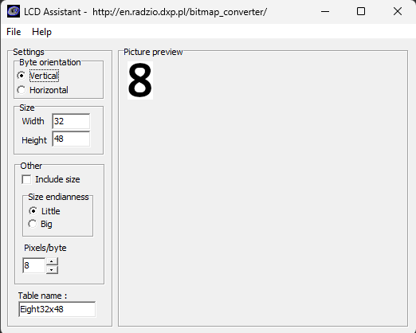

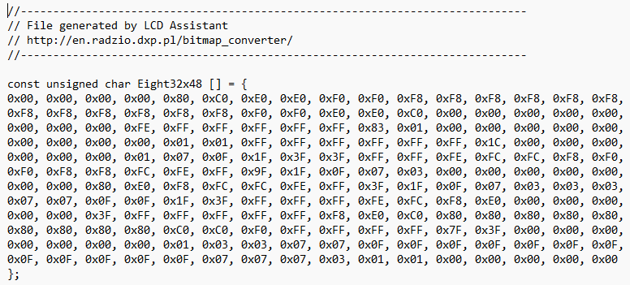


### HEX file

In order to program the Pro Mini you do not even have to use the Arduino IDE as detailed above but directly burn the Altimeter.ino.hex file using the files in the [Your Repository Directory]\Altimeter\Code\ directory. Actually these can be in an arbitrary directory: <br>
[Altimeter.bat](Code/Altimeter.bat)<br>
[Altimeter.ino.hex](Code/Altimeter.ino.hex)<br>
[avrdude.conf](Code/avrdude.conf)<br>
[avrdude.exe](Code/avrdude.exe)<br>

1. Attach the FTDI Serial Adaptor to the altimeter as detailed in the previous section.
1. Using the Windows Device Manager utility determine the COM port it is attached to.   
1. Adjust the COM port number in the Altimeter.bat file if necessary
1. Open a Windows terminal and go to the directory that contains Altimeter.ino.hex and the other three files.
1. Type .\Altimeter.bat Enter on the command line.
1. This burns the HEX file to the Pro Mini and if sucessfull finish with a final terminal output line of "avrdude done. Thank you."

## Parts list
  
### Core components
Pricing and availability as of 1-Oct-2024

| Qty | Product | Description | AUD Cost | Comment | Designator |
| --- | --- | --- | --- | --- | --- |
| 1 | [DEV-11113](https://core-electronics.com.au/arduino-pro-mini-328-5v-16mhz.html) | Arduino Pro Mini 328 - 5V/16MHz | $17.40 | The brains of this project, no pre-soldered headers  | XC1 |
| 1 | [POLOLU-3760](https://core-electronics.com.au/graphical-oled-display-128x64-1-3-white-spi.html) | Graphical OLED Display: 128x64, 1.3", White, SPI, 5V  | $22.20 | The display used in this project with [this driver chip](Extra/SH1106.pdf) | U1 |
| 1 | [BARO (52)](https://www.freetronics.com.au/products/barometric-pressure-sensor-module) | I2C 5V Barometric Pressure Sensor Module | $19.00 | based on the [MS5673 chip](Extra/ENG_DS_MS5637-02BA03_B5.pdf) | U2 |
| 1 | [ADA5580](https://core-electronics.com.au/adafruit-max17048-lipoly-liion-fuel-gauge-and-battery-monitor-stemma-jst-ph-qt-qwiic.html) | Adafruit I2C 5V MAX17048 LiPoly / LiIon Fuel Gauge and Battery Monitor - STEMMA JST PH & QT / Qwiic | $11.75 | based on the [MAX17048 chip](Extra/MAX17048-MAX17049.pdf) | U5 |
| 1 | [ADA1904](https://core-electronics.com.au/adafruit-micro-lipo-w-microusb-jack-usb-liion-lipoly-charger-v1.html) | Adafruit Micro Lipo w/MicroUSB Jack - USB LiIon/LiPoly charger - v1 | $13.45 | based on the [MCP73831 chip](Extra/MCP73831.pdf) | U4 |
| 1 | [POLOLU-2564](https://core-electronics.com.au/pololu-5v-step-up-voltage-regulator-u1v10f5.html) | Pololu 5V Step-Up Voltage Regulator U1V10F5 | $9.50 | based on this [chip](Extra/tps61200_193680627bc.pdf) | U3 |
| 1 | [S4724](https://www.altronics.com.au/p/s4724-3.7v-1100mah-polymer-lithium-ion-battery-lipo/) | 3.7V 1100mAh Polymer Lithium Ion Battery (LiPo) | $21.95 | The LiPo battery that powers this project | Connects to U4 using JST-PH connector |
| 1 | [HB6004](https://jaycar.com.au/p/HB6004) | Jiffy Case Imac Blue UB5 | $3.75 | Enclosure for project, 83mm x 54mm x 31mm |  |
| 1 | [SS0812](https://jaycar.com.au/p/SS0812) | Sub-miniature DPDT Panel Mount Switch | $1.75 | on/off switch to power this altimeter | SW1 |
| 1 | [HP9544](https://jaycar.com.au/p/HP9544) | PC Boards Vero Type Strip - 95mm x 305mm | $12.95 | Contains the circuit | |
| 1 | [XC4464](https://jaycar.com.au/p/XC4464) | Duinotech Arduino Compatible USB to Serial Adaptor (uses FT232 chip) | $28.95 | used to program the Arduino Pro Mini (XC1) ||

### Other parts

| Qty | Product | Description | AUD Cost | Comment | Designator |
| --- | --- | --- | --- | --- | --- |
| 1 | [WW4030](https://jaycar.com.au/p/WW4030) | Tinned Copper Wire 22AWG - 100 gram Roll | $19.95 | for wiring up above Vero board | |
|1 | [HM3212](https://jaycar.com.au/p/HM3212) | 40 Pin Header Terminal Strip ( only need 4 pins ) | $1.45 | for soldering in sections to boards to attach to veroboard | |
|1 | [WH3004](https://jaycar.com.au/p/WH3004) | Yellow Light Duty Hook-up Wire - 25m (less than 30cm needed) | $7.95 | used for miscellaneous connections | |
|1 | [WH3007](https://jaycar.com.au/p/WH3007) | White Light Duty Hook-up Wire - 25m (less than 30cm needed) | $7.95 | used for miscellaneous connections | |
|1 | [HP0924](https://jaycar.com.au/p/HP0924) | M3 x 12mm Tapped Nylon Spacers - Pk.25 ( only need 4 x 3mm )| $11.95 | For mounting screen to Jiffy case | |
|1 | [HP0403](https://jaycar.com.au/p/HP0403) | M3 x 10mm Steel Screws - Pk.25 ( only need 4 )| $3.55 | For mounting screen to Jiffy case | |
|1 | [HP0425](https://jaycar.com.au/p/HP0425) | M3 Steel Nuts - Pk.25 ( only need 4 )| $3.70 | For mounting screen to Jiffy case | |
|1 | [HP0148](https://jaycar.com.au/p/HP0148) | 3mm Nylon Washers - Pk.10 ( only need 0 )| $2.95 | For mounting screen to Jiffy case | |