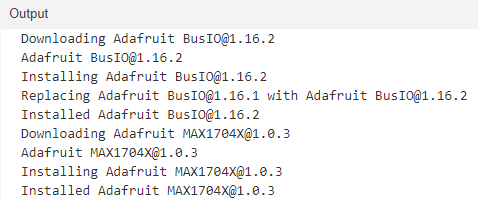

# Altimeter

## Contents

- [Summary](#Summary)
- [Setup Raspberry PI](#Setup-Raspberry-PI)
- [Setup Arduino](#Setup-Arduino)
- [Design circuit board](#Design-circuit-board)
  - [Install TinyCAD](#Install-TinyCAD)
  - [Install VeeCAD](#Install-VeeCAD)
- [Assemble weather station](#Assemble-weather-station)
  - [Build circuit board](#Build-circuit-board)
  - [Assemble electronics](#Assemble-electronics)
  - [Attach BME280 sensors](#Attach-BME280-sensor)
  - [Attach wind and rain gauges](#Attach-wind-and-rain-gauges)
  - [Attach wifi interface](#Attach-wifi-interface)
  - [Attach camera](#Attach-camera)
  - [Attach power](#Attach-power)  
- [Use weather station](#Use-weather-station)
  - [Access web interface](#Access-web-interface)
  - [Automate data collection](#Automate-data-collection)
- [List of parts](#List-of-parts)
  - [Core components](#Core-components)
  - [Connectors](#Connectors)
  - [External components](#External-components)

## Summary
This github repository details the construction of a proof of concept digital skydiving altimeter.

It is based on a pressure sensor board using the MS5637 chip and a 1.3" OLED SH1106 SPI driven screen. All is coordinated using an Arduino Pro Mini 5V 16Mhz microcontroller.  In addition it uses a circuit board based on the MCP73831 chip for charging the 3.7V LiPo battery and a battery level gauge circuit board using the MAX17048 chip. Voltage for the circuit is boosted from the LiPo to 5V by a Pololu U1V10F5 regulator board. There are no additional discrete components in this circuit apart from the on/off SPDT switch. Capactitors for current spikes have been considered but not implemented. 

The only interface elements are an on/off switch and a USB-B charging port. When first switched on the zeroed altitude is displayed in thousands of feet. A large font is used for digits above 99 feet. Eg. 13.532 indicates 13,532 feet above initial switching on altitude, with 13.5 displayed in a large font and 32 in small. Also a leading zero is dsiplayed for altitiudes inclusively between 100 and 999 feet. Eg 852 feet is displayed as 0.852 with 0.8 in large font and  52 in small.

In addition on the top line in a small font is displayed the temperature in Celsius on the pressure sensor board, the current voltage of the LiPo battery, its % remaining capacity and a graphic of the same. This also indicates if the battery is being charged. See third picture below.

# LCD Assistant
download from https://en.radzio.dxp.pl/bitmap_converter/
I have used this to generate files for this project. Fonts, splash screens, graphics. Bitmaps generated with GIMP.
It only runs on Windows. No fancy downloads necessary. Just run the LCDAssistant.exe file from anywhere.
Its exe file is availble in the Extra directory.

LCD Assistant is a free tool for converting monochromatic bitmaps to data arrays for easy use with programs for embedded systems with microcontrollers and graphics monochromatic LCD displays like a T6963C, KS0108, SED1335 etc. Program creates files for use with any C compiler : for AVR, ARM, PIC, 8051 and ohter microcontrollers. You can use directly with Arduino, mbed and any other design environment based on C compiler. If you use graphic LCDs and you want to display pictures, this program is for You! You can draw an image in you best graphic editor and save it in a *.bmp file.

To convert image from bitmap file (or other standard graphics file format) to data array select from File menu command 'Load image'. Next, select byte orientation (for example : vertical for KS0108, SED1520, SPLC0501C etc; horizontal for : T6963C, SED1335 etc). If in data array must be image size (width and height) select 'Include size' checkbox and specify endianness of size (for example: Little endian for AVR; Big endian for ST7). Size are placed in two 16-bit variables at the begin of data array. Next, specify pixels/byte parameter. If display can support miscellaneous font size (displays with T6963C controller) image can be converted to array of bytes with specified amount of pixels in each byte. At last select from "File" menu command "Save output". Data array will be saved in specified file. Next, just include this file into project and use array name as parameter for function that displays bitmap on LCD. If you have trouble with use generating file, or program will generate wrong files please let me know.
